# Тема 3. Базовые операции языка Python
Отчет по Теме #3 выполнил(а):
- Пстыга Александра Сергеевна
- АИС-23-1

| Задание | Лаб_раб | Сам_раб |
| ------ | ------ | ------ |
| Задание 1 | + | + |
| Задание 2 | + | + |
| Задание 3 | + | + |
| Задание 4 | + | + |
| Задание 5 | + | + |
| Задание 6 | + | + |
| Задание 7 | + | + |
| Задание 8 | + | + |
| Задание 9 | + | + |
| Задание 10 | + | + |

знак "+" - задание выполнено; знак "-" - задание не выполнено;


## Лабораторная работа №1
### Выведите в консоль три строки. Первая – любое число. Вторая – любое число в виде строки. Третья – любое число с плавающей точкой.

```python
print(123)
print('123')
print(1.23)
```
### Результат.
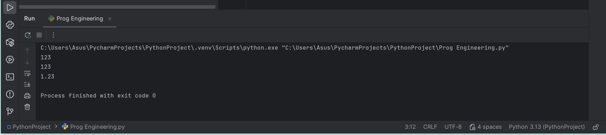

## Выводы

В данном коде выводятся три строки с использованием функции `print()`. Каждая строка содержит разные значения:

1. `print(123)`: Выводится целое число 123. Это число не взаимодействует со строковыми операциями и выводится как есть.

2. `print('123')`: Выводится строка '123', так как она заключена в одинарные кавычки. В этом случае это текстовая строка, а не число.

3. `print(1.23)`: Выводится число с плавающей точкой 1.23. Так же, как и в первом случае, оно выводится как числовое значение.

## Лабораторная работа №2
### Выведите в консоль три строки. Первая – результат сложения или вычитания минимум двух переменных типа int. Вторая – результат сложения или вычитания минимум двух переменных типа float. Третья – результат сложения или вычитания минимум двух переменных типа int и float.
```python
print(3562 + 5417)
print(5.7 + 2.3)
print(1.23 + 6 + 9.4)
```
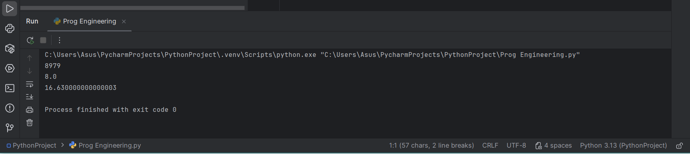

## Выводы

1. `print(3562 + 5417)`: Выводится целое число, так как при сложении целых чисел число-результат также будет целым.

2. `print(5.7 + 2.3)`: Выводится дробное число типа float, так как при сложении таких чисел число-результат также будет типа float.

3. `print(1.23 + 6 + 9.4)`: Выводится дробное число типа float, так как при сложении таких чисел с целым числом целое число воспринимается, как 6.0. Число-результат также будет типа float.

## Лабораторная работа №3
### Выведите в консоль три строки. Первая – обычная строка. Вторая – F строка с использованием заранее объявленной переменной. Третья – сложите две или более строк в одну.
```python
print("Привет, это я!")

who = "я!"
print(f"Привет, это {who}")

one = "Привет, "
two = "это я!"
print(one + two)
```
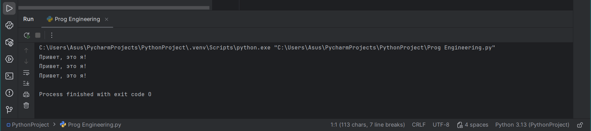

## Выводы
1. `print("Привет, это я!")`: Выводится цельная строка.

2. `print(f"Привет, это {who}")`: Выводится строка "Привет, это", а за тем в качестве второй части строки выводится строковая переменная who.

3. `print(one + two)`: Подряд выводятся две заранее объявленные строковые переменные one и two, при выводе составляющие строку-результат.
  
## Лабораторная работа №4
### Выведите в консоль три строки. Первая – трансформация любого типа переменной в bool. Вторая – трансформация любого типа переменной в float или int. Третья – трансформация любого типа переменной в str.
```python
one = "Ой"
print(bool(one))

two = 1500
print(float(two))

three = None
print(str(three))
```
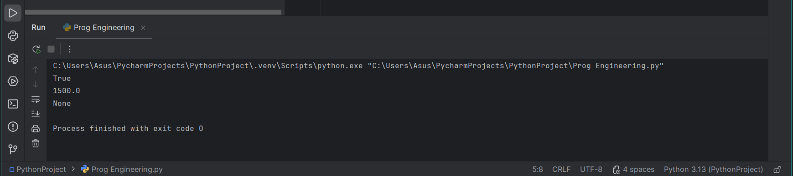

## Выводы
1. Переменная one изначально типа string "Ой", функция bool преобразует ее в переменную типа bool
   
2. Переменная one изначально типа int 1500, функция float преобразует ее в переменную типа float
   
3. Переменная one изначально типа bool None, функция str преобразует ее в переменную типа str

## Лабораторная работа №5
### Присвойте трем переменным различные значения, воспользовавшись функцией input()
```python
one = input("one: ")
two = input("two: ")
three = input("three: ")
print(one, two, three)
```
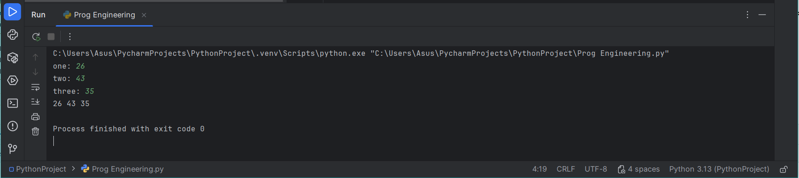

## Выводы
1. Во всех трех случаях функция input() позволяет ввести пользователю переменные с клавиатуры, любые какие он захочет
   
2. С помощью print(one, two, three) переменные подряд выводятся в строку в консоли

## Лабораторная работа №6
### Создайте две любые числовые переменные и выполните над ними несколько математических операций: возведение в степень, обычное деление, целочисленное деление, нахождение остатка от деления. При желании вы можете проверить как работают эти вычисления с разными типами данных, например, сначала создать две переменные int, затем создать две переменные float и наконец создать переменные типа int и float и провести над ними операции, прописанные выше.
```python
a = 7
b = 23
print("Возведение в степень:", a**b)
print("Обычное деление:", a/b)
print("Целочисленное деление:", a//b)
print("Остаток от деления:", a%b)
```
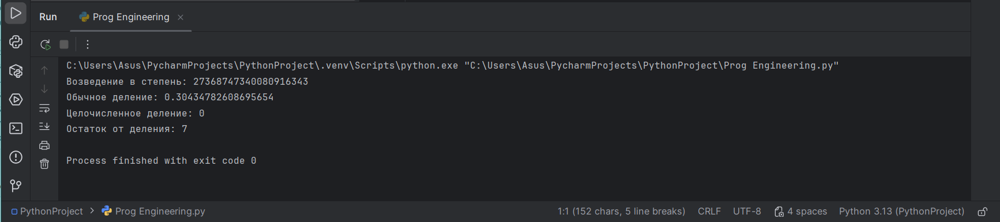

## Выводы
1. Переменные a и b выводятся через print() в разном виде с помощью дополнительных операций

2. Возведение в степень реализуется с помощью знаков **, a возводится в степень b

3. Обычное деление реализуется с помощью знака /, a делится на b с остатком, который выводится после точки

4. Целочисленное деление реализуется с помощью знаков //, a делится на b, но остаток от деления не выводится после точки

## Лабораторная работа №7
### Создайте любую строковую переменную и произведите над ней математическое действие умножение на любое число.
```python
line = "Окак"
print(line *10)
```
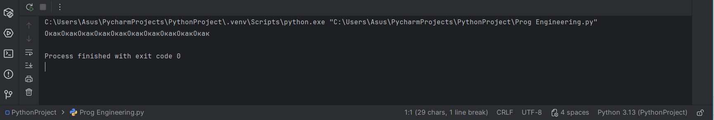

## Выводы
1. Строка при выводе благодаря *10 внутри print() выводится не один раз, а десять

## Лабораторная работа №8
### Создайте любую строковую переменную и произведите над ней математическое действие умножение на любое число.
```python
line = "авада кедавра!"
print(line.count("а"))
```
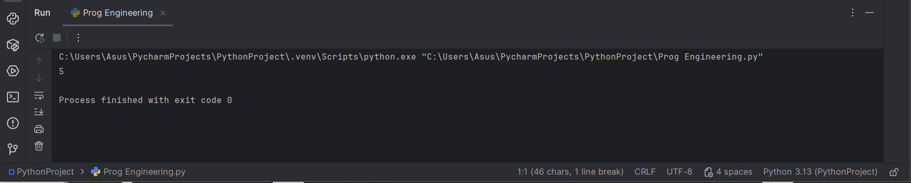

## Выводы
1. Строка при выводе благодаря .count("а") внутри print() подсчитывает сколько раз в строке встретился символ "a"

## Лабораторная работа №9
### Напишите предложение ‘Hello World’ в две строки. Написанная программа должна занимать одну строку в редакторе кода.
```python
print("Пим\nпарирам")
```
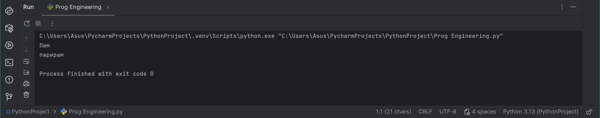

## Выводы
1. Строка при выводе благодаря \n внутри print() переносит слово после знака в следующую строку при выводе

## Лабораторная работа №10
### Из предложения ‘Hello World’ выведите в консоль только 2 символ, а затем выведите слово ‘Hello’.
```python
line = "Hello World"
print(line[1])
print(line[:5])
```
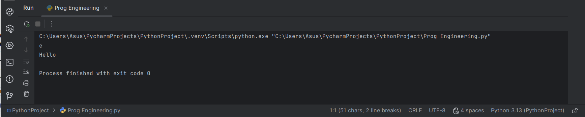

## Выводы
1. Строка при выводе благодаря line[] внутри print() позволяет вывести только символы или слова с указанным в скобках номером

## Самостоятельная работа №1
### Выведите в консоль булевую переменную False, не используя слово False в строке или изначально присвоенную булевую переменную. Программа должна занимать не более двух строк редактора кода.
```python
print(not True)
```
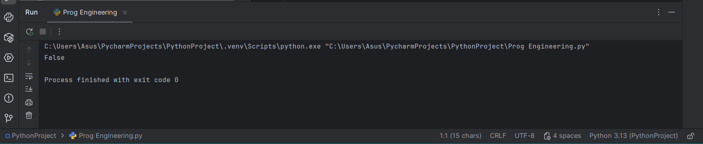

- ## Выводы
1. Строка при выводе благодаря not внутри print() преобразует указанное True в противоположное значение False
  
## Самостоятельная работа №2
### Присвоить значения трем переменным и вывести их в консоль, используя только две строки редактора кода.
```python
a, b, c = 1, 2, 3
print(a, b, c)
```
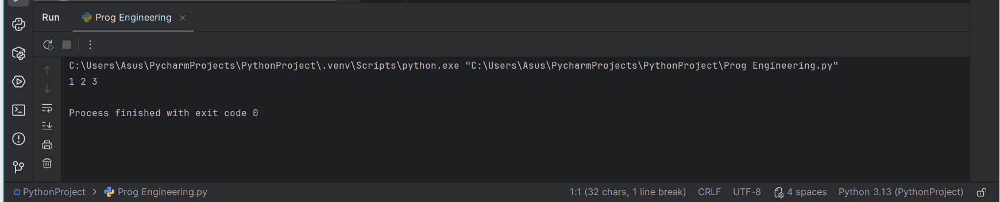

- ## Выводы
1. Если объявлять переменные и присваивать им значения через запятую, а также ввести таким образом через print(a, b, c), то код займет две строки, хотя в нем объявлено 6 переменных
  
## Самостоятельная работа №3
### Реализуйте ввод данных в программу, через консоль, в виде только целых чисел (тип данных int). То есть при вводе буквенных символов в консоль, программа не должна работать. Программа должна занимать не более двух строк редактора кода.
```python
print(int(input()))
```
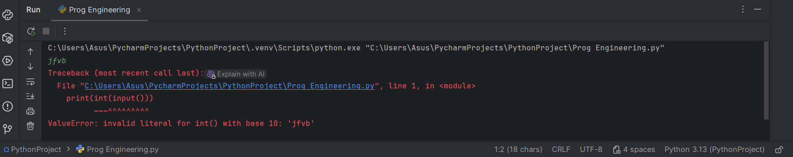
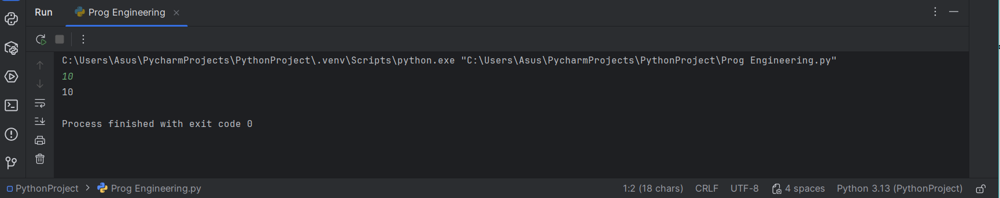

- ## Выводы
1. Строка при выводе благодаря int внутри print() и перед input() позволяет контролировать, чтобы вводимое значение было только int, так как в противном случае программа выдаст ошибку
  
## Самостоятельная работа №4
### Создайте только одну строковую переменную. Длина строки должна не превышать 5 символов. На выходе мы должны получить строку длиной не менее 16 символов. Программа должна занимать не более двух строк редактора кода.
```python
word = "Опапа"
print(word*3)
```
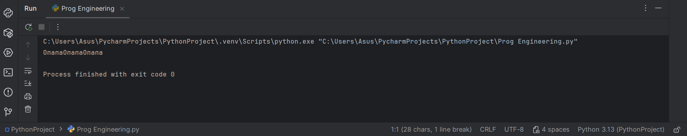

- ## Выводы
1. Строка при выводе благодаря *3 внутри print() позволяет вывести указанную строку не один раз, а три. Так как длина первоначальной строки 5, то длина выведенной строки 15
  
## Самостоятельная работа №5
### Создайте три переменные: день (тип данных - числовой), месяц (тип данных - строка), год (тип данных - числовой) и выведите в консоль текущую дату в формате: “Сегодня день месяц год. Всего хорошего!” используя F строку и оператор end внутри print(), в котором вы должны написать фразу “Всего хорошего!”. Программа должна занимать не более двух строк редактора кода.
```python
from datetime import datetime;
print("Сегодня "f"{datetime.now().day} {datetime.now().strftime('%B')} {datetime.now().year}", end ='. Всего хорошего!')
```
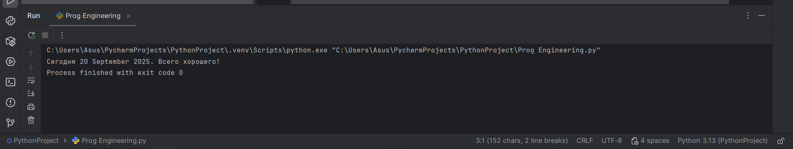

- ## Выводы
1. С помощью строки from datetime import datetime; импортируем из библиотеки необходимую для задания функцию

2. Второй строкой вызываем по очереди день (datetime.now().day), месяц значением string (datetime.now().strftime('%B')) и год (datetime.now().year) строкой f. Все это выводится в предложении
  
## Самостоятельная работа №6
### В предложении ‘Hello World’ вставьте ‘my’ между двумя словами. Выведите полученное предложение в консоль в одну строку. Программа должна занимать не более двух строк редактора кода.
```python
a = "Hello world"
print(a.replace(" ", " my "))
```
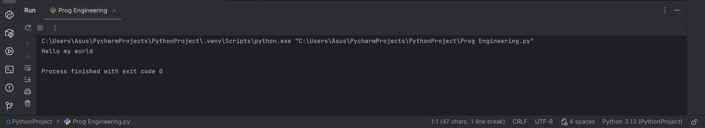

- ## Выводы
1. Строка при выводе благодаря .replace(" ", " my ") внутри print() позволяет заменить символ в строке, в данном случае пробел н нужное слово "my"
  
## Самостоятельная работа №7
### Узнайте длину предложения ‘Hello World’, результат выведите в консоль. Программа должна занимать не более двух строк редактора кода.
```python
a = "Hello world"
print(len(a))
```
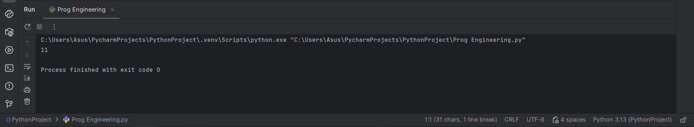

- ## Выводы
1. Строка при выводе благодаря len() внутри print() позволяет узнать длину введенной строки
  
## Самостоятельная работа №8
### Переведите предложение ‘HELLO WORLD’ в нижний регистр. Программа должна занимать не более двух строк редактора кода.
```python
print("HELLO WORLD".lower())
```
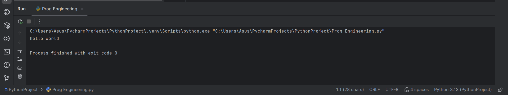

- ## Выводы
1. Строка при выводе благодаря .capitalize() внутри print() позволяет преобразовать всю строку в нижний регистр, при этом первая буква также остается в нижнем регистре
  
## Самостоятельная работа №9
### Самостоятельно придумайте задачу по проходимой теме и решите ее. Задача должна быть связанна со взаимодействием с числовыми значениями.
```python
print(bin(23))
```
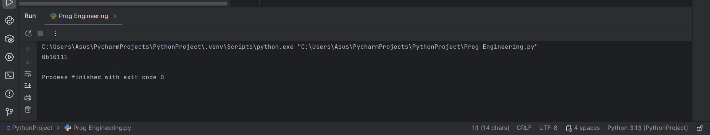

- ## Выводы
1. Строка при выводе благодаря bin() внутри print() позволяет преобразовать число в двоичную систему счисления
  
## Самостоятельная работа №10
### Самостоятельно придумайте задачу по проходимой теме и решите ее. Задача должна быть связанна со взаимодействием со строковыми значениями.
```python
print("HELLO WORLD".capitalize())
```
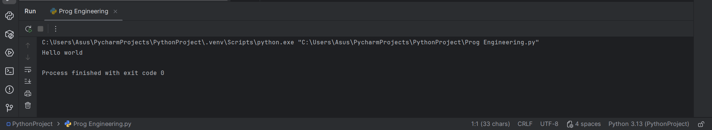

- ## Выводы
1. Строка при выводе благодаря .capitalize() внутри print() позволяет преобразовать всю строку в нижний регистр, при этом первая буква остается в верхнем регистре

## Общие выводы по теме
- Python имеет множество полезных средств для удобной работы со строками и числами. Числа можно преобразовывать в разные типы, бробные, целые и т.д. Такжеможно выполнять все базовые арифметические операции и переводить в разные системы счисления.
