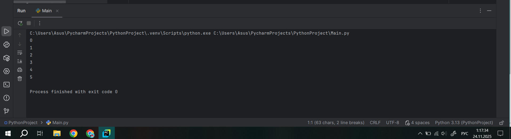
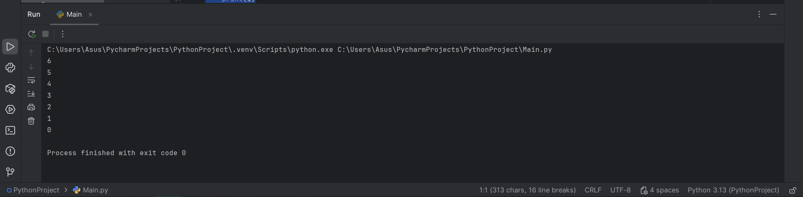
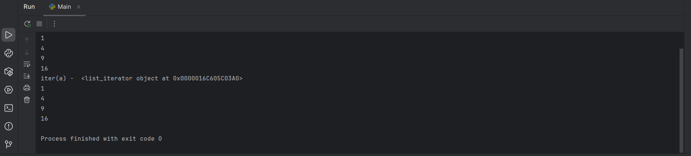
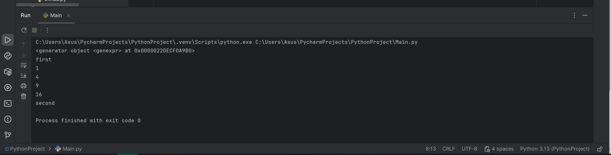
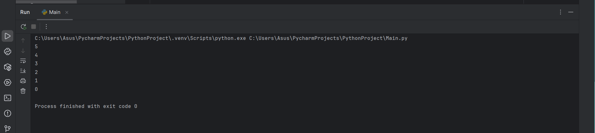

# Тема 11. Итераторы и генераторы
Отчёт по теме выполнила:
  - Пстыга Александра Сергеевна
  - АИС-23-1

| Задание | Лаб_раб | Сам_раб |
| ------ | ------ | ------ |
| Задание 1 | + | + |
| Задание 2 | + | + | 
| Задание 3 | + | 
| Задание 4 | + |
| Задание 5 | + |

знак "+" - задание выполнено; знак "-" - задание не выполнено;

## Лабораторные задания:

### №1. 
Простой итератор, но у него нет гибкой настройки, например его нельзя развернуть. Он работает просто как next(), но нет prev()
### Ответ:
```python
numbers = [0, 1, 2, 3, 4, 5]
for item in numbers:
  print(item)
```


### Вывод: 
Код создает список чисел от 0 до 5 и выводит каждое число на экран с помощью цикла for.

### №2. 
Класс итератор с гибкой настройкой и удобными применением
### Ответ: 
```python
class CountDown:
    def __init__(self, start):
        self.count = start + 1

    def __iter__(self):
        return self

    def __next__(self):
        self.count -= 1
        if self.count < 0:
            raise StopIteration
        return self.count


counter = CountDown(6)
for i in counter:
    print(i)
```


### Вывод: 
Класс CountDown реализует обратный отсчет от заданного числа до нуля. При создании экземпляра класса через метод __init__ начальное значение увеличивается на единицу для корректной работы итератора. Метод __iter__ возвращает сам объект, а метод __next__ уменьшает счетчик и возвращает текущее значение, пока оно не станет отрицательным, после чего возбуждается исключение StopIteration, прекращающее цикл. В результате выполнения кода будет напечатан обратный отсчет: 6, 5, 4, 3, 2, 1, 0.

### №3. 
Генератор списка
### Ответ: 
```python
a = [i ** 2 for i in range (1, 5)]

print ('a - ', a)
for i in a:
    print(i)

print ('iter(a) - ', iter(a))
for i in a:
    print(i)
```


### Вывод: 
В данном коде создается список a, содержащий квадраты чисел от 1 до 4, после чего этот список дважды выводится на экран: сначала целиком, а затем поэлементно. Также создается итератор для списка a с помощью функции iter(), но он не используется.

### №4. 
Выражения генераторы
### Ответ: 
```python
b = (i ** 2 for i in range(1,5))
print(b)
print('first')
for i in b:
    print(i)
print('second')
for i in b:
    print(i)
```


### Вывод: 
В этом коде создается генератор b, который генерирует квадраты чисел от 1 до 4. Генераторы являются одноразовыми итераторами, то есть после того, как они были исчерпаны (например, при прохождении через цикл for), их нельзя использовать повторно без пересоздания. Поэтому первый цикл for выведет числа 1, 4, 9, 16, а второй цикл ничего не выведет, так как генератор уже был исчерпан.

### №5. 
Такой же счетчик, как и в первом задании, только это генератор и использует yield
### Ответ: 
```python
def countdown(count):
    while count >= 0:
        yield count
        count -= 1

if __name__ == '__main__':
    counter = countdown(5)
    for i in counter:
        print(i)
```

### Вывод: 
Код представляет собой функцию countdown, которая использует генератор для обратного отсчета от заданного числа до нуля включительно. В основной части программы создается экземпляр генератора с начальным значением 5, после чего элементы генератора выводятся в цикле for. Таким образом, программа напечатает числа от 5 до 0.


## Самостоятельные задания:
### №1. 
Вас никак не могут оставить числа Фибоначчи, очень уж они вас заинтересовали. Изучив новые возможности Python вы решили реализовать программу, которая считает числа Фибоначчи при помощи итераторов. Расчет начинается с чисел 1 и 1. Создайте функцию fib(n), генерирующую n чисел Фибоначчи с минимальными затратами ресурсов. Для реализации этой функции потребуется обратиться к инструкции yield (Она не сохраняет в оперативной памяти огромную последовательность, а дает возможность “доставать” промежуточные результаты по одному). Результатом решения задачи будет листинг кода и вывод в консоль с числом Фибоначчи от 200.
```python
def fibonacci():
    fib1 = fib2 = 1
    
    for i in range(2,200):
        fib1, fib2 = fib1, fib2 + fib2
        print(fib2, end='')
        
if __name__ = '__main__':
    fibonacci()
```
### Ответ: 
```python
import time

def timer(func):
    def wrapper(*args, **kwargs):
        start_time = time.time()
        result = func(*args, **kwargs)
        end_time = time.time()
        total_time = end_time - start_time
        print(f"Время выполнения функции {func.__name__}: {total_time:.4f} секунд")
        return result
    return wrapper

@timer
def fibonacci():
    fib1 = fib2 = 1
    for i in range(2, 200):
        fib1, fib2 = fib1, fib2 + fib2
        print(fib2, end=' ')

if __name__ == "__main__":
    fibonacci()
```


### Вывод: 
Код содержит декоратор timer, который сначала фиксирует время начала выполнения, затем выполняет саму функцию, а после окончания её работы рассчитывает затраченное время и выводит результат. Основная функция fibonacci вычисляет числа Фибоначчи до 200-го элемента и выводит их на экран. При запуске программы декоратор измерит общее время выполнения функции fibonacci.
   
### №2. 
К коду предыдущей задачи добавьте запоминание каждого числа Фибоначчи в файл “fib.txt”, при этом каждое число должно находиться на отдельной строчке. Результатом выполнения задачи будет листинг кода и скриншот получившегося файла.
### Ответ: 
```python
def read_file(filename):
    try:
        with open(filename, 'r') as file:
            data = file.read().strip()
            if not data:
                raise ValueError("Файл пустой")
            return data
    except FileNotFoundError:
        print(f"Файл {filename} не найден.")
    except ValueError as e:
        print(e)

# Проверим оба файла
print("Проверка пустого файла (Empty.txt):")
result = read_file('Empty.txt')
if result is not None:
    print(result)

print("\nПроверка не пустого файла (Not_empty.txt):")
result = read_file('Not_empty.txt')
if result is not None:
    print(result)
```


### Вывод: 
Код определяет функцию read_file, которая пытается открыть файл для чтения и вернуть его содержимое. Если файл не существует, программа выводит сообщение об ошибке. Если файл пуст, также выводится ошибка. В конце кода проверяются два файла: Empty.txt и Not_empty.txt.

## Общий вывод по теме: 
Тема 10 посвящена декораторам и исключениям в Python. Декораторы представляют собой мощный инструмент, позволяющий изменять поведение функций и классов без необходимости изменения их исходного кода. Они являются функциями высшего порядка, которые принимают другую функцию в качестве аргумента и возвращают новую, обернутую функцию. Это позволяет добавлять дополнительную функциональность, такую как логирование, кэширование или измерение времени выполнения, что делает код более гибким и поддерживаемым.
Также рассматривается применение декораторов к классам, что позволяет расширять их функциональность, добавляя новые методы или атрибуты. В Python доступны различные готовые декораторы из сторонних библиотек, что облегчает разработку.
Что касается исключений, они представляют собой механизм обработки ошибок, позволяющий программистам контролировать и управлять ситуациями, когда возникают ошибки во время выполнения программы. Используя блоки try-except, разработчики могут обрабатывать исключения, предотвращая аварийное завершение программы и обеспечивая более безопасное выполнение кода.
В целом, изучение декораторов и исключений является важной частью освоения Python, поскольку эти концепции помогают создавать более эффективные и надежные приложения.
