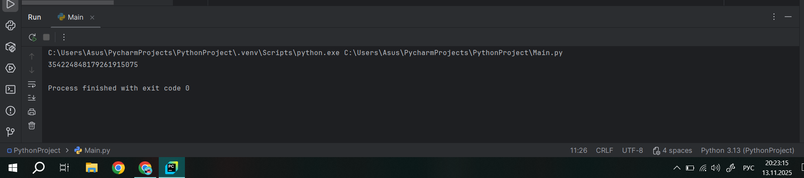
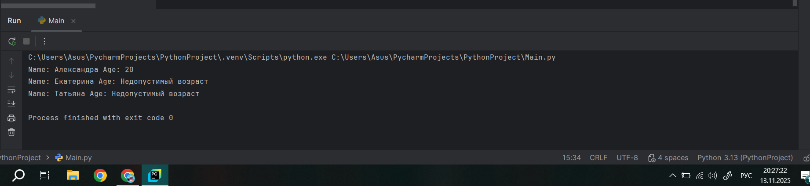
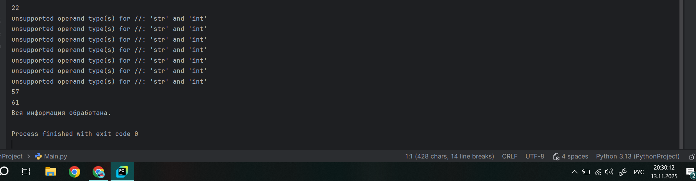
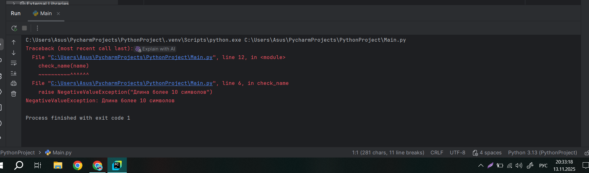
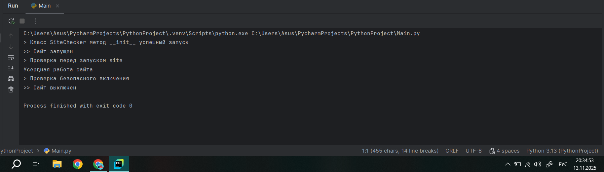
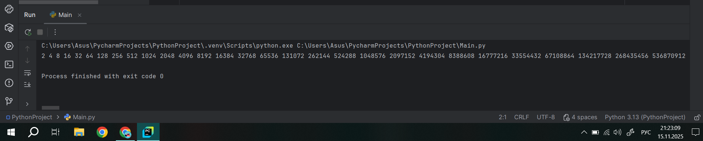
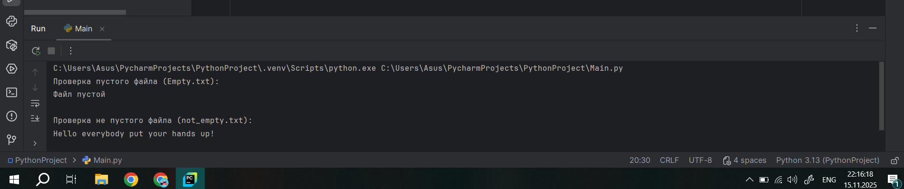
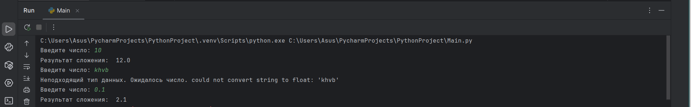
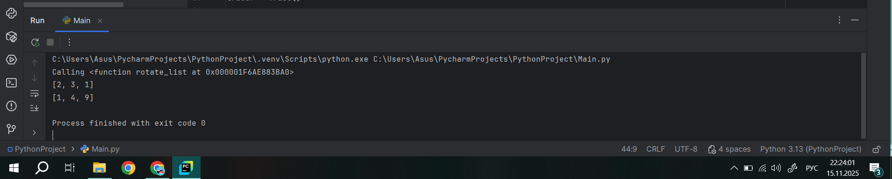
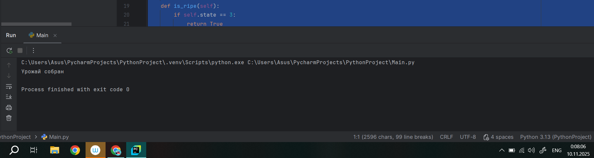

# Тема 10. Декораторы и исключения
Отчёт по теме выполнила:
  - Пстыга Александра Сергеевна
  - АИС-23-1

| Задание | Лаб_раб | Сам_раб |
| ------ | ------ | ------ |
| Задание 1 | + | + |
| Задание 2 | + | + | 
| Задание 3 | + | + | 
| Задание 4 | + | + |
| Задание 5 | + | + | 

знак "+" - задание выполнено; знак "-" - задание не выполнено;

## Лабораторные задания:

### №1. 
Вам нужно написать программу, которая будет считать числа Фибоначчи для 100 и запустить ее без этого декоратора и с ним, посмотреть на разницу во времени решения поставленной задачи. 
P.S. при запуске без декоратора может долго не ждать, для наглядности хватит 10 секунд ожидания.
### Ответ:
```python
from functools import lru_cache

@lru_cache(None)
def fibonacci(n):
    if n == 0:
        return 0
    elif n == 1:
        return 1
    return fibonacci(n - 1) + fibonacci(n - 2)
if __name__ == '__main__':
    print(fibonacci(100))
```


### Вывод: 
Этот код использует декоратор lru_cache для реализации функции вычисления чисел Фибоначчи с использованием мемоизации. В данном случае, при каждом вызове функции результат будет сохраняться в кэше, что позволит избежать повторного вычисления значений для уже известных аргументов.

### №2. 
Илья пишет свой сайт и ему необходимо сделать минимальную проверку входа данных пользователей при регистрации. Для этого он реализовал функцию, которая выводит данные пользователя на экран и решает, что будет проверять правильность введённых данных при помощи детектора, но в этом ему потребовалась ваша помощь. Напишите детектор для функции, который будет принимать все параметры вызываемой функции (имя, возраст) и проверять чтобы возраст был больше 0 и меньше 130. Примечание, что важно сколько пользователь введет данных на сайт к Илье, будут обрабатываться только первые 2 аргумента.
### Ответ: 
```python
def check(input_func):
    def output_func(*args):
        name, age = args[0], args[1]
        if age < 0 or age > 130:
            age = 'Недопустимый возраст'
        input_func(name,age)
    return output_func

@check
def personal_info(name, age):
    print(f"Name: {name} Age: {age}")

if __name__ == '__main__':
    personal_info('Александра', 20)
    personal_info('Екатерина', -5)
    personal_info('Татьяна', 138, 15, 48, 2)
```


### Вывод: 
Код содержит функцию-декоратор check, которая проверяет корректность возраста перед передачей данных в декорируемую функцию. Если возраст выходит за пределы допустимого диапазона (от 0 до 130), он заменяется строковым значением 'Недопустимый возраст'. Основная функция personal_info выводит имя и возраст, а декоратор используется для предварительной проверки значений. В примере демонстрируется работа декоратора при передаче корректных и некорректных значений возраста.

### №3. 
Вам понравилась идея Ильи с сайтом, и вы решили дальше работать вместе с ним. Но вот в вашем проекте появилась проблема, кто-то пытается сломать вашу функцию с получением данных для сайта. Эта функция работает только с данными integer, а какой-то недохакер пытается все сломать и вместо нужного типа данных отправляет string. Воспользуйтесь исключениями, чтобы неподходящий тип данных не ломал ваш сайт. Также дополнительно можете обернуть весь код функции в try/except/finally для того, чтобы программа вас оповестила о том, что выявлена какая-то ошибка или программа успешно выполнена.
### Ответ: 
```python
def data(*args):
    try:
        for i in range(len(*args)):
            try:
                result = (args[0][i] * 15) // 10
                print(result)
            except Exception as ex:
                print(ex)
    except Exception as ex:
        print(ex)
    finally:
        print('Вся информация обработана.')

if __name__ == '__main__':
    data([1, 15, 'Hello', 'i', 'try', 'to', 'crash', 'your', 'site', 38, 41])
```


### Вывод: 
Код определяет функцию data, которая принимает произвольное количество аргументов через оператор распаковки *args. Внутри функции происходит попытка обработать каждый элемент переданного списка. Если элемент является числом, то он умножается на 15 и делится на 10, результат выводится на экран. В случае ошибки при обработке элемента (например, если элемент не число), ошибка перехватывается и выводится сообщение об ошибке. После обработки всех элементов выводится финальное сообщение о завершении работы программы.


### №4. 
Продолжая работу над сайтом, мы решили написать собственное исключение, которое будет вызываться в случае, если в функцию проверки имени при регистрации передана строка длиннее десяти символов, а если имя имеет допустимую длину, то в консоль выводиться "Успешная регистрация".
### Ответ: 
```python
class NegativeValueException(Exception):
    pass

def check_name(name):
    if len(name) > 10:
        raise NegativeValueException("Длина более 10 символов")
    else:
        print('Успешная регистрация')

if __name__ == '__main__':
    name = '12345678910'
    check_name(name)
```


### Вывод: 
В данном коде определяется пользовательское исключение NegativeValueException, которое наследуется от базового класса исключений Exception. Затем создается функция check_name, которая проверяет длину переданного имени: если длина превышает 10 символов, то возбуждается исключение NegativeValueException с сообщением об ошибке, иначе выводится сообщение о успешной регистрации. В основной части программы происходит вызов функции check_name с именем длиной ровно 10 символов.

### №5. 
После запуска сайта вы поняли, что вам необходимо добавить логотерм для отслеживания его работы. Готовыми вариантами вы не воспользовались, и поэтому решили создать очень простую паролину. Для этого создали две функции: init (вызывается при создании класса декоратора в программе) и call_ (вызывается при вызове декоратора). Создайте необходимый вам декоратор. Выведите все логи в консоль.
### Ответ: 
```python
class SiteChecker:
    def __init__(self, func):
        print('> Класс SiteChecker метод __init__ успешный запуск')
        self.func = func
    def __call__(self):
        print('> Проверка перед запуском', self.func.__name__)
        self.func()
        print('> Проверка безопасного включения')
@SiteChecker
def site():
    print('Усердная работа сайта')
if __name__ == '__main__':
    print('>> Сайт запущен')
    site()
    print('>> Сайт выключен')
```

### Вывод: 
В данном коде создается класс SiteChecker, который используется для декорирования функции site(). При инициализации класса SiteChecker выводится сообщение о запуске метода __init__, а также сохраняется ссылка на декорируемую функцию. Метод __call__ позволяет вызывать объект класса как обычную функцию, при этом он выводит сообщения до и после вызова декорированной функции. В результате выполнения кода сначала будет выведено сообщение о проверке перед запуском, затем выполнится функция site() и, наконец, будет выведено сообщение о безопасной проверке завершения работы.


## Самостоятельные задания:
### №1. 
Вовочка решил заняться спортивным программированием на Python, но для этого он должен знать за какое время выполняется его программа. Он решил, что для этого ему идеально подойдет детектор для функции, который будет вычислять за какое время выполнится та или иная функция. Помогите Вовочке в его начинаниях и напишите такой детектор.
Подсказка: необходимо использовать модуль time
Декоратор необходимо использовать для этой функции:
```python
def fibonacci():
    fib1 = fib2 = 1
    
    for i in range(2,200):
        fib1, fib2 = fib1, fib2 + fib2
        print(fib2, end='')
        
if __name__ = '__main__':
    fibonacci()
```
### Ответ: 
```python
import time

def timer(func):
    def wrapper(*args, **kwargs):
        start_time = time.time()
        result = func(*args, **kwargs)
        end_time = time.time()
        total_time = end_time - start_time
        print(f"Время выполнения функции {func.__name__}: {total_time:.4f} секунд")
        return result
    return wrapper

@timer
def fibonacci():
    fib1 = fib2 = 1
    for i in range(2, 200):
        fib1, fib2 = fib1, fib2 + fib2
        print(fib2, end=' ')

if __name__ == "__main__":
    fibonacci()
```


### Вывод: 
Код содержит декоратор timer, который сначала фиксирует время начала выполнения, затем выполняет саму функцию, а после окончания её работы рассчитывает затраченное время и выводит результат. Основная функция fibonacci вычисляет числа Фибоначчи до 200-го элемента и выводит их на экран. При запуске программы декоратор измерит общее время выполнения функции fibonacci.
   
### №2. 
Посмотрев на Вовочку, вы также загорелись идеей спортивного программирования, начав тренировки вы узнали, что для решения некоторых задач необходимо считать данные из файлов. Но через некоторое время вы столкнулись с проблемой что файлы бывают пустыми, и вы не получаете вводные данные для решения задач. После этого вы решили не просто считать данные из файла, а всю конструкцию обрабатывать в исключения, чтобы избежать такой проблемы. Создайте пустой файл и файл, в котором есть какая-то информация. Напишите код программы. Если файл пустой, то нужно вывести исключение ("бросить исключение") и вывести в консоль "файл пустой", а если он не пустой, то вывести информацию из файла.
### Ответ: 
```python
def read_file(filename):
    try:
        with open(filename, 'r') as file:
            data = file.read().strip()
            if not data:
                raise ValueError("Файл пустой")
            return data
    except FileNotFoundError:
        print(f"Файл {filename} не найден.")
    except ValueError as e:
        print(e)

# Проверим оба файла
print("Проверка пустого файла (Empty.txt):")
result = read_file('Empty.txt')
if result is not None:
    print(result)

print("\nПроверка не пустого файла (Not_empty.txt):")
result = read_file('Not_empty.txt')
if result is not None:
    print(result)
```


### Вывод: 
Код определяет функцию read_file, которая пытается открыть файл для чтения и вернуть его содержимое. Если файл не существует, программа выводит сообщение об ошибке. Если файл пуст, также выводится ошибка. В конце кода проверяются два файла: Empty.txt и Not_empty.txt.

### №3. 
Напишите функцию, которая будет складывать 2 и введенное пользователем число, но если пользователь введет строку или другой неподходящий тип данных, то в консоль выводится ошибка "Неподходящий тип данных. Ожидалось число.". Реализовать функциональную программу необходимо через try/except и подобрать правильный тип исключения. Создать собственное исключение нельзя. Проведите несколько тестов, в которых исключение вызывается и нет. Результатом выполнения задачи будет листинг кода и полученный вывод в консоль.
### Ответ: 
```python
def sum():
    while True:
        num = input("Введите число: ")
        try:
            number = float(num)
        except ValueError as e:
            print(f"Неподходящий тип данных. Ожидалось число. {e}")
            continue
        result = 2 + number
        print(f"Результат сложения: ", result)

if __name__ == '__main__':
    sum()
```


### Вывод: 
Код определяет функцию sum, которая запрашивает у пользователя ввод числа, проверяет корректность введённых данных с использованием конструкции try/except для обработки ошибок, а затем складывает введённое число с числом 2 и выводит результат. Если пользователь введёт данные неверного типа, программа выведет сообщение об ошибке и предложит ввести число заново.

### №4. 
Создайте собственный декоратор для двух любых придуманных функций. Декораторы, которые использовались ранее в работе нельзя воссоздавать. Результатом выполнения задачи будет класс декоратора, две как-то связанных с ним функции, скручивают консоли с выполненной программой и подробые комментарии, которые будут описывать работу вашего кода.

### Ответ: 
```python
class Trace:
    # Конструктор класса Trace. Устанавливает атрибут enabled в True.
    def __init__(self):
        self.enabled = True

    # Метод __call__ позволяет объекту класса Trace вести себя как функция.
    # Он принимает функцию f и возвращает обёртку для этой функции.
    def __call__(self, f):
        # Внутренняя функция-обертка, которая будет вызываться вместо оригинальной функции.
        def wrap(*args, **kwargs):
            # Если трассировка включена, выводим сообщение о вызове функции.
            if self.enabled:
                print(f'Calling {f}')
            # Вызываем оригинальную функцию с переданными аргументами и возвращаем результат.
            return f(*args, **kwargs)
        # Возвращаем обёрнутую функцию.
        return wrap

# Создаем экземпляр класса Trace.
tracer = Trace()

# Декорируем функцию rotate_list с помощью tracer.
@tracer
def rotate_list(l):
    # Функция сдвигает элементы списка на одну позицию влево.
    return l[1:] + [l[0]]

# Создаём список.
l = [1, 2, 3]
# Применяем декорированную функцию rotate_list к списку l.
l = rotate_list(l)
# Выводим изменённый список.
print(l)

# Функция возводит каждый элемент списка в квадрат.
def square_list(l):
    return [x**2 for x in l]

# Создаём новый список.
l = [1, 2, 3]
# Применяем функцию square_list к списку l.
l = square_list(l)
# Выводим изменённый список.
print(l)
```


### Вывод: 
Код создает класс Trace, который используется для трассировки вызовов функций. Класс имеет метод __call__, позволяющий использовать экземпляр класса как декоратор. Когда функция декорирована экземпляром Trace (tracer), перед ее выполнением выводится сообщение о вызове этой функции, если свойство enabled установлено в True. В примере создается функция rotate_list, которая перемещает первый элемент списка в конец. Эта функция декорируется объектом tracer. При вызове rotate_list сначала печатается сообщение о том, что она вызвана, а затем выполняется сама функция. Функция square_list не декорирована и просто возводит каждый элемент списка в квадрат.

### №5. 
Создайте собственное исключение, которое будет использоваться в двух любых фрагментах кода. Исключения, которые использовались ранее в работе нельзя воссоздавать. Результатом выполнения задачи будет класс исключения, код к которому в двух местах используется это исключение, скрипт консоли с выполненной программой и подробные комментарии, которые будут описывать работу вашего кода.

### Ответ: 
```python
class InvalidOperationError(Exception):
    # Определение пользовательского исключения для случаев недопустимых операций.
    # Наследуется от базового класса Exception.

    def __init__(self, message="Недопустимая операция"):
        # Конструктор класса принимает сообщение об ошибке.
        # Если сообщение не передано, используется значение по умолчанию.
        super().__init__(message)
        # Вызывается конструктор родительского класса Exception,
        # чтобы передать ему сообщение об ошибке.


def divide_numbers(a, b):
    # Функция деления двух чисел.
    if b == 0:
        # Проверка делителя на равенство нулю.
        raise InvalidOperationError("Деление на ноль недопустимо")
        # Если деление на ноль, выбрасывается исключение InvalidOperationError
        # с соответствующим сообщением.
    return a / b
    # Если деление возможно, возвращается результат.


# Пример использования функции
try:
    result = divide_numbers(10, 0)
    # Попытка вызова функции деления с параметрами 10 и 0.
except InvalidOperationError as e:
    # Обработка исключений типа InvalidOperationError.
    print(f"Произошла ошибка: {e}")
    # Вывод сообщения об ошибке, если она произошла.
else:
    print(result)
    # Если ошибки нет, выводится результат деления.
```


### Вывод: 
В приведенном коде создается пользовательское исключение InvalidOperationError, которое наследуется от встроенного класса исключений Exception. Это исключение используется для обработки ситуации деления на ноль в функции divide_numbers. Функция divide_numbers принимает два аргумента a и b. Если второй аргумент равен нулю, то генерируется исключение InvalidOperationError с сообщением об ошибке. В противном случае функция возвращает результат деления первого числа на второе. Пример использования демонстрирует обработку исключения при вызове функции divide_numbers: если возникает ошибка, она перехватывается блоком except, и сообщение об ошибке выводится на экран. Если ошибки нет, то результат вычисления отображается.

## Общий вывод по теме: 
Тема 10 посвящена декораторам и исключениям в Python. Декораторы представляют собой мощный инструмент, позволяющий изменять поведение функций и классов без необходимости изменения их исходного кода. Они являются функциями высшего порядка, которые принимают другую функцию в качестве аргумента и возвращают новую, обернутую функцию. Это позволяет добавлять дополнительную функциональность, такую как логирование, кэширование или измерение времени выполнения, что делает код более гибким и поддерживаемым.
Также рассматривается применение декораторов к классам, что позволяет расширять их функциональность, добавляя новые методы или атрибуты. В Python доступны различные готовые декораторы из сторонних библиотек, что облегчает разработку.
Что касается исключений, они представляют собой механизм обработки ошибок, позволяющий программистам контролировать и управлять ситуациями, когда возникают ошибки во время выполнения программы. Используя блоки try-except, разработчики могут обрабатывать исключения, предотвращая аварийное завершение программы и обеспечивая более безопасное выполнение кода.
В целом, изучение декораторов и исключений является важной частью освоения Python, поскольку эти концепции помогают создавать более эффективные и надежные приложения.
