Отчет по Теме #1 выполнил(а):
- Пстыга Александра Сергеевна
- АИС-23-1

| Задание | Лаб_раб | 
| ------ | ------ |
| Задание 1 | + | 
| Задание 2 | + | 
| Задание 3 | + | 
| Задание 4 | + |
| Задание 5 | + | 
| Задание 6 | + | 
| Задание 7 | + | 
| Задание 8 | + | 
| Задание 9 | + | 
| Задание 10 | + | 
| Задание 11 | + | 
| Задание 12 | + | 
| Задание 13 | + | 
| Задание 14 | + | 
| Задание 15 | + | 

знак "+" - задание выполнено; знак "-" - задание не выполнено;

## Лабораторная работа №1
### Установка

## Лабораторная работа №2
### Настройка

## Лабораторная работа №3
### Создание нового репозитория

## Лабораторная работа №4
### Подготовка файлов
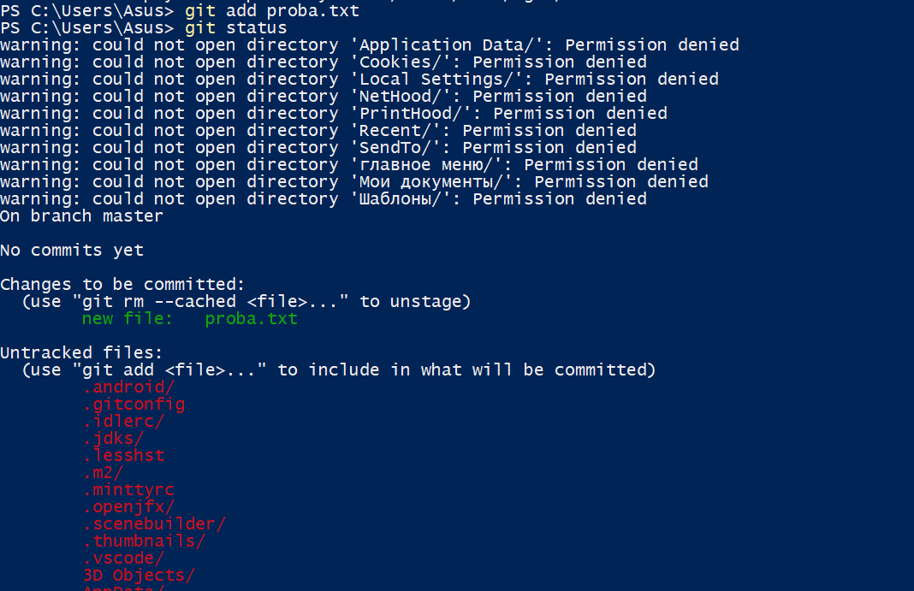

## Лабораторная работа №5
### Фиксация изменений
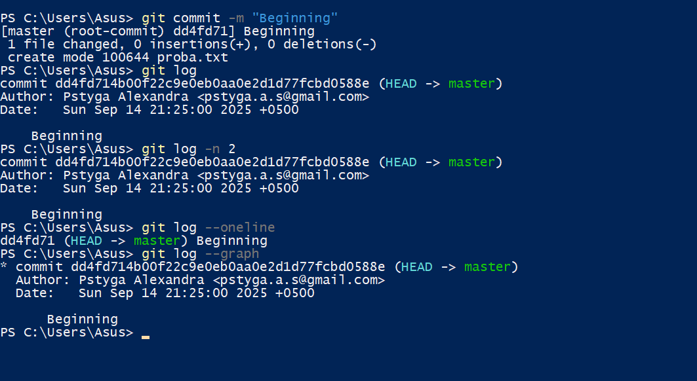

## Лабораторная работа №6
### Подключение к удаленному репозиторию
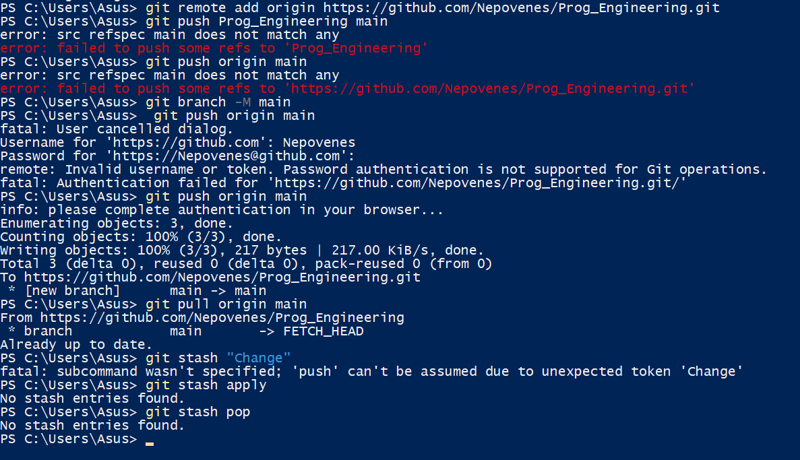

## Лабораторная работа №7
### Ветвление
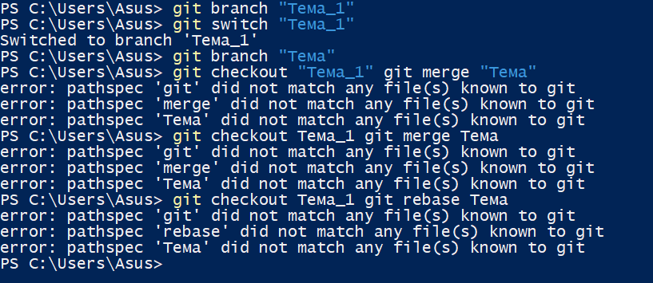

## Лабораторная работа №8
### Особенности применения "Фэтч"
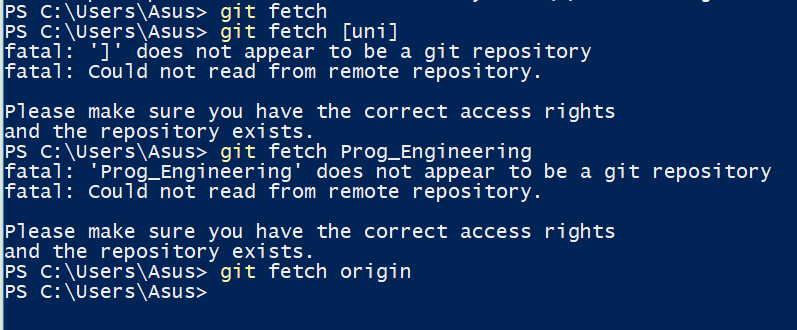

## Лабораторная работа №9
### Удаление файлов, веток, локальных и удаленных репозиториев
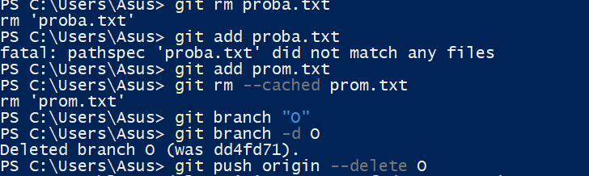

## Лабораторная работа №10
### Отслеживание изменений коммитов
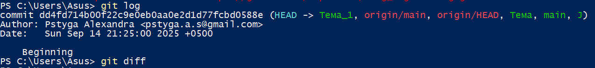

## Лабораторная работа №11
### Возвращение файлов к предыдущему(определенному) состоянию
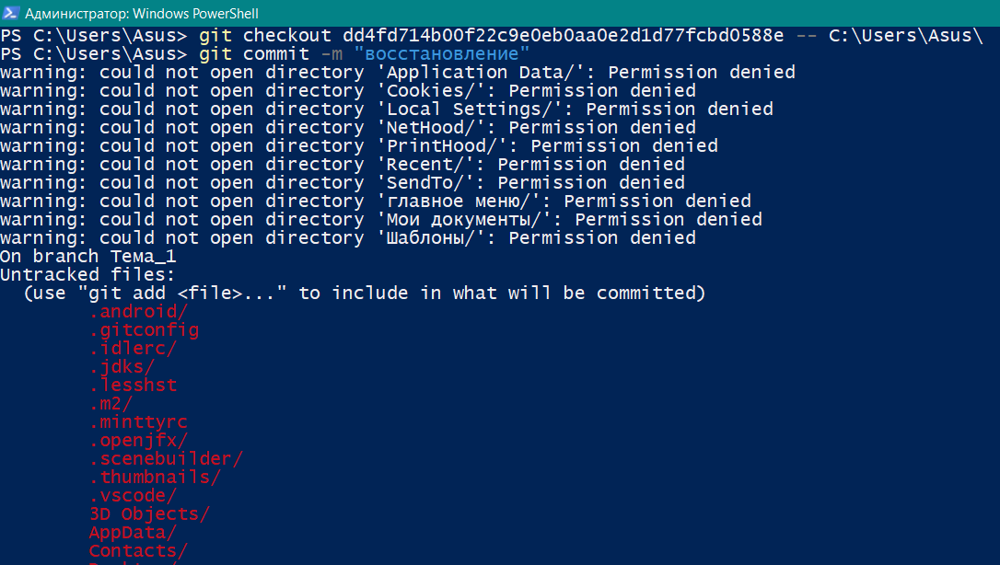

## Лабораторная работа №12
### Возвращение к предыдущему коммиту
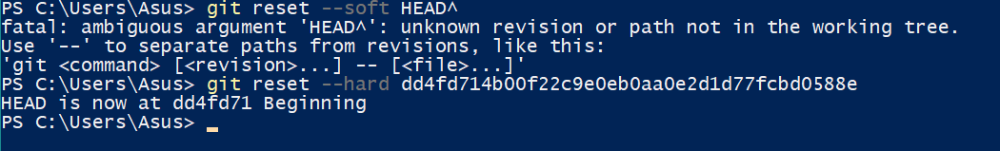

## Лабораторная работа №13
### Исправление коммита
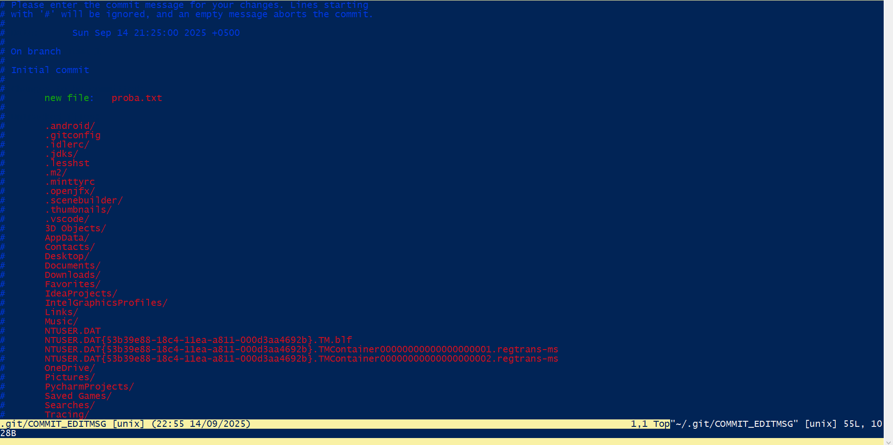

## Лабораторная работа №14
### Разрешение конфликтов при слиянии
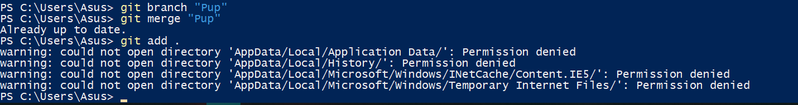

## Лабораторная работа №15
### Настройка .gitignore
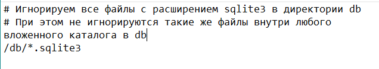

## Общие выводы по теме
Git - программа, позволяющая удобно контролировать, отслеживать и управлять версиями продукта, которым занимается несколько разработчиков. Данная программа позволяет понятно проследить все изменения, вносимые когда-либо и кем-либо в данный код с их описанием, времением и конкретными правками, а также изменить свое/чужое изменение уже после его принятия. Она имеет множество полезных функций управления версиями, позволяющих без ограничений и опасений писать код во многопользовательском режиме.

