# Тема 5. Базовые операции языка Python
Отчет по Теме #5 выполнил(а):
- Пстыга Александра Сергеевна
- АИС-23-1

| Задание | Лаб_раб | Сам_раб |
| ------ | ------ | ------ |
| Задание 1 | + | + |
| Задание 2 | + | + |
| Задание 3 | + | + |
| Задание 4 | + | + |
| Задание 5 | + | + |
| Задание 6 | + |
| Задание 7 | + |
| Задание 8 | + |
| Задание 9 | + | 
| Задание 10 | + |

знак "+" - задание выполнено; знак "-" - задание не выполнено;


## Лабораторная работа №1
### Друзья предложили вам сыграть в игру "найди отличия и убери повторения (версия для программистов)". Суть игры состоит в том, что на вход программы поступает два множества, а ваша задача вывести все элементы первого, которых нет во втором. А вы как раз недавно прошли множество и знаете их возможности, поэтому это не составит труда для вас.

```python
set_1 = {'White', 'Red', 'Black', 'Pink'}
set_2 = {'Red', 'Green', 'Blue', 'Red'}

print(set_1 - set_2)
```
### Результат.
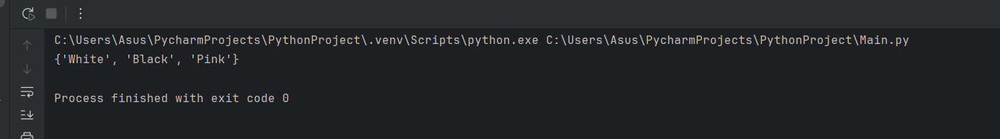

## Выводы

В данном фрагменте кода используются множества set_1 и set_2. Множество set_1 содержит элементы 'White', 'Red', 'Black' и 'Pink'. Множество set_2 содержит элементы 'Red', 'Green', 'Blue' и 'Red'. Выполняется операция вычитания множеств set_1 - set_2, которая удаляет все общие элементы между множествами, оставляя только уникальные для set_1.

## Лабораторная работа №2
### Напишите две одинаковые программы, только одна будет использовать set(), а вторая frozenset() и попробуйте к исходному множеству добавить несколько элементов, например, через цикл.
```python
a = set('abcdefg')
print(a)
for i in range (1, 5):
    a.add(i)
print(a)
```
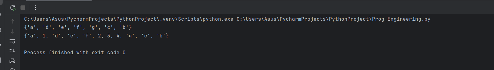

## Выводы

В этом коде создаётся множество a, содержащее элементы 'abcdefg'. Затем в цикле добавляются числа от 1 до 4 включительно, после чего выводится обновлённый список элементов множества.

## Лабораторная работа №3
### На вход в программу поступает список (минимальной длиной 2 символа). Напишите программу, которая будет менять первый и последний элемент списка. Р.S. В Python есть прикольное свойство, благодаря которому эту задачу можно решить более красиво, использовав всего 2 строчки кода, если интересно можете самостоятельно найти это решение.
```python
def replace(input_list):
    memory = input_list[0]
    input_list[0] = input_list[-1]
    input_list[-1] = memory

    return input_list

print(replace([1, 2, 3, 4, 5]))
```
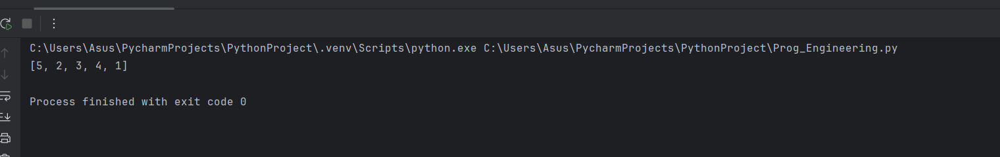

## Выводы
Функция replace принимает список и выполняет следующую операцию: элементы списка меняются местами между первым и последним элементами. Она возвращает модифицированный список. В данном примере при вызове функции для списка [1, 2, 3, 4, 5] результат будет выглядеть так: [5, 2, 3, 4, 1].
  
## Лабораторная работа №4
### На вход в программу поступает список (минимальной длиной 10 символов). Напишите программу, которая выводит элементы с индексами от 2 до 6. В программе необходимо использовать "срезы".
```python
a = [1, 2, 3, 4, 5, 6, 7, 8 ,9]
print(a[2:6])
```
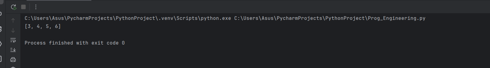

## Выводы
В этом коде создаётся список a, содержащий числа от 1 до 9 включительно. Затем происходит печать подсписка этого списка, начиная с индекса 2 и заканчивая индексом 5 включительно.

## Лабораторная работа №5
### Иван задумался о поиске «бесполезного» числа, полученного из списка. Суть поиска в следующем: он берет произвольный список чисел, находит самое большое из них, а затем делит его на длину списка. Студент пока не придумал, где может пригодиться подобное значение, но идет у вас помощи в реализации такой функции useless().
```python
ddef useless(lst):
    return max(lst) / len(lst)

print(useless([3,5,7,33]))
print(useless([-3,5.3,7,-33.4]))
print(useless([-3.45,5.4,-7,0.33]))
```
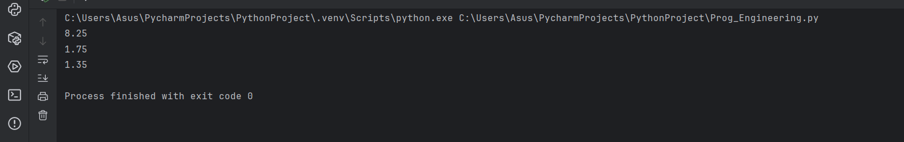

## Выводы
Функция useless принимает список чисел и возвращает результат деления максимального элемента списка на длину этого списка. Приведенный пример демонстрирует вызов функции для трех различных списков.

## Лабораторная работа №6
### Ребята не могут определиться каким супергероем они хотят стать. У них есть случайно составленный список супергероев, и вы должны определить кто из ребят будет каким супергероем. Необходимо использовать разделение списков.
```python
Winx = ['Bloom', 'Stella', 'Flora', 'Musa', 'Aisha', 'Tecna']
Eva, Sasha, Nika, Nastya, Vika, Ksusha = Winx
print('Эва - ', Eva)
print('Саша - ', Sasha)
print('Ника - ', Nika)
print('Настя - ', Nastya)
print('Вика - ', Vika)
print('Ксюша - ', Ksusha)
```
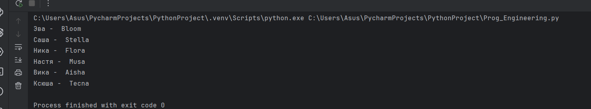

## Выводы
В коде происходит присваивание переменным из одной строки, при этом используется синтаксическая конструкция распаковки именованного кортежа. Переменная Winx содержит список строк с именами персонажей. Затем имена персонажей присваиваются новым переменным через оператор распаковки кортежа, который позволяет одновременно присвоить значения всем перечисленным переменным. После этого выполняется печать значений этих переменных.

## Лабораторная работа №7
### Вовочка, прочитав передачи "Слабое звено" решил написать программу, которая также будет находить самое слабое звено (минимальный элемент) и удалять его, только делать он это хочет не с людьми, а со списком. Помогите Вовочке с реализацией программы. Подсказка: для этого вам необходимо отсортировать список и удалить значение при помощи pop().
```python
a = [-24.5, 0, 77, 120.4, -10]
a.sort()
print('Отсортированный список:\n', a)
a.pop(0)
print('Отсортированный список без наименьшего элемента:\n', a)
```


## Выводы
Код создает список целых чисел a, затем сортирует этот список и выводит отсортированную версию списка. Далее удаляет первый элемент списка с помощью метода pop и снова выводит список, уже без первого элемента.

## Лабораторная работа №8
### Михаил решил создать большой п-мерный список, для этого он случайным образом создал несколько списков, состоящих минимум из 3, а максимум из 10 элементов и поместил их в один большой список. Он также как и Иван не знает зачем ему эта сейчась нужно, но надеется на то, что это пригодится ему в будущем.
```python
from random import randint

def list_maker():
    a = [randint(1, 100)]*randint(3, 10)
    return a

if __name__ == '__main__':
    result = []
    for i in range(randint(1,5)):
        result.append(list_maker())

        print(result)
```
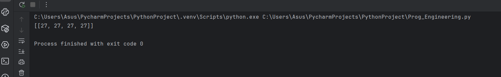

## Выводы
Код генерирует случайные списки чисел от 1 до 100 разной длины от 3 до 10 элементов. Затем создается новый список, который содержит случайное количество таких списков (от 1 до 5). Списки добавляются в результирующий список.

## Лабораторная работа №9
### Вы работаете в ресторане и отвечаете за статистику покупок, ваша задача сравнить между собой заказы покупателей, которые указаны в разном порядке. Реализуйте функцию superset(), которая принимает 2 множества. Результат работы функции: вывод в консоль одного из сообщений в зависимости от ситуации: 1 - «Сумерножество не обнаружено» 2 - «Объект {X} является чистым супермножеством» 3 - «Множества равны»
```python
def superset(set_1, set_2):
    if set_1 > set_2:
        print(f'Объект {set_1} - чистое супермножество')
    elif set_1 == set_2:
        print(f'Множества равны')
    elif set_1 < set_2:
        print(f'Объект {set_2} - чистое супермножество')
    else:
        print(f'Супермножество не обнаружено')

if __name__ == '__main__':
    superset({1,8,3,5}, {3,5})
    superset({1,8,3,5}, {5, 3, 8, 1})
    superset({3, 5}, {5, 3, 8, 1})
    superset({90, 100}, {3, 5})
```
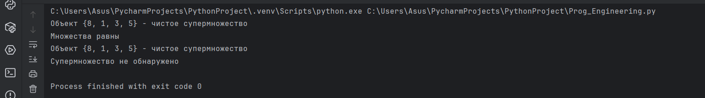

## Выводы
Функция superset сравнивает два множества и определяет, является ли одно из них чистым супермножеством другого. Если первое множество больше второго, то первое множество является чистым супермножеством. Если множества равны, они объявляются равными. Если второе множество больше первого, то второе множество является чистым супермножеством. Если множества не удовлетворяют ни одному из условий, печатается сообщение, что супермножество не обнаружено.

## Лабораторная работа №10
### Предположим, что вам нужно разобрать стопку бумаг, но нужно сначала начать работу с нижней, "переверните стопку". Вам дан производственный список. Представим его в обратном порядке. Программа должна занимать не более двух строк в редакторе кода.
```python
my_list = [2,5,8,3]
print(my_list[::-1])
```
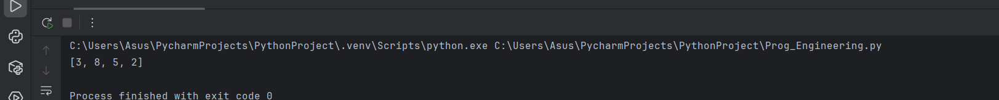

## Выводы
Код создает список [2,5,8,3] и использует срезы для обратного отображения списка. Результатом будет список [3,8,5,2].

## Самостоятельная работа №1
### Ресторан на предприятии ведет учет посещений за неделю при помощи кода работника. У них есть список со всеми посещениями за неделю. Ваша задача посчитать:

### 1. Сколько было выдано чеков
### 2. Сколько разных людей посетило ресторан
### 3. Какой работник посетил ресторан больше всех раз
### Список выданных чеков за неделю:
### [8734, 2345, 8201, 6621, 9999, 1234, 5678, 8201, 8888, 4321, 3365, 1478, 9865, 5555, 7777, 9998, 1111, 2222, 3333, 4444, 5556, 6666, 5410, 7778, 8889, 4445, 1439, 9604, 8201, 3365, 7502, 3016, 4928, 5837, 8201, 2643, 5017, 9682, 8530, 3250, 7193, 9051, 4506, 1987, 3365, 5410, 7168, 7777, 9865, 5678, 8201, 4445, 3016, 4506, 4506]
### Результатом выполнения задачи будет: листинг кода, и вывод в консоль, в котором будет указана вся необходимая информация.
```python
Ресторан на предприятии ведет учет посещений за неделю при помощи кода работника. У них есть список со всеми посещениями за неделю. Ваша задача посчитать:

1. Сколько было выдано чеков
2. Сколько разных людей посетило ресторан
3. Какой работник посетил ресторан больше всех раз
Список выданных чеков за неделю:
[8734, 2345, 8201, 6621, 9999, 1234, 5678, 8201, 8888, 4321, 3365, 1478, 9865, 5555, 7777, 9998, 1111, 2222, 3333, 4444, 5556, 6666, 5410, 7778, 8889, 4445, 1439, 9604, 8201, 3365, 7502, 3016, 4928, 5837, 8201, 2643, 5017, 9682, 8530, 3250, 7193, 9051, 4506, 1987, 3365, 5410, 7168, 7777, 9865, 5678, 8201, 4445, 3016, 4506, 4506]
Результатом выполнения задачи будет: листинг кода, и вывод в консоль, в котором будет указана вся необходимая информация.
```
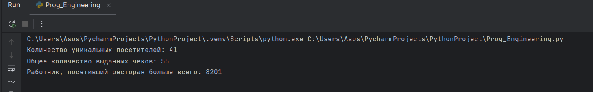

## Выводы
Код производит анализ списка посещений ресторана для получения информации о количестве уникальных посетителей, общем количестве выданных чеков и наиболее частом посетителе. Для этого используются функции из модуля collections и метод Counter.
  
## Самостоятельная работа №2
### На физкультуре студенты сдавали бег, у преподавателя физкультуры есть список всех результатов, ему нужно узнать

### Трилучшие результата
### Три худшие результата
### Все результаты начиная с 10
### Ваша задача помочь сму в этом.

### Список результатов бега:

### [10.2, 14.8, 19.3, 22.7, 12.5, 33.1, 38.9, 21.6, 26.4, 17.1, 30.2, 35.7, 16.9,
### 27.8, 24.5, 16.3, 18.7, 31.9, 12.9, 37.4]
### Результатом выполнения задачи будет: листинг кода, и вывод в консоль, в котором будет указана вся необходимая информация.
```python
import random

def main():
    value = random.randint(1, 6)
    print(f"Выпало: {value}")
    if value == 5 or value == 6:
        print("Вы победили")
    if value == 3 or value == 4:
        main()
    if value == 1 or value == 2:
        print("Вы проиграли")
if __name__ == "__main__":
    main()
```
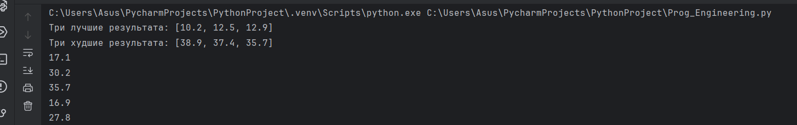

## Выводы
Функция main() принимает список значений results и выполняет следующие операции:

Использует метод sorted(), чтобы отсортировать список results по возрастанию и получить первые три элемента (best_results). Затем эти элементы выводятся на экран.
Аналогично сортирует список results по убыванию и получает последние три элемента (worst_results), которые также выводятся на экране.
Проходит через значения списка results, начиная с индекса 9, и выводит каждое значение на экран.
В конце выполняется проверка на выполнение функции при запуске файла. Если условие if name == "main" истинно, вызывается функция main().
  
## Самостоятельная работа №3
### Преподаватель по математике придумал странную задачку. У вас есть три списка с элементами, каждый элемент которых — длина стороны треугольника, ваша задача найти площади двух треугольников, составленные из максимальных и минимальных элементов полученных. списков. Результатом выполнения задачи будет: листинг кода, и вывод в консоль, в котором будут указаны два этих значения.

### Три списка:

### one = [12,25,3,48,71]
### two = [5,18,40,62,98]
### three = [2,21,37,56,84]
```python
import datetime
import time

for i in range(5):
    time1 = datetime.datetime.now()
    time2 = time1.strftime("%H:%M:%S")
    print(time2)
    time.sleep(1)
```
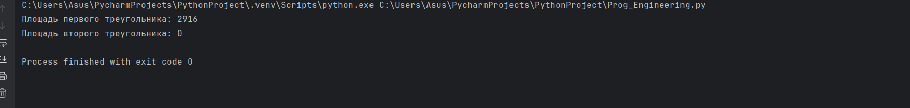

- ## Выводы
Этот код выполняет две задачи: рассчитывает площадь треугольника по формуле Герона и находит максимальные и минимальные значения в списках чисел. Во-первых, функция heron_area принимает три стороны треугольника и возвращает их площадь, используя формулу Герона. Затем создаются три списка чисел: one, two и three. Функция find_max_min принимает список и возвращает максимальное и минимальное значение в этом списке. Далее, для каждого списка определяются максимальные и минимальные значения, и эти значения используются для вычисления площади двух треугольников с помощью функции heron_area. Результаты отображаются на экране.
  
## Самостоятельная работа №4
### Никто не любит получать плохие оценки, поэтому Борис решил это исправить. Допустим, что все оценки студента за семестр хранятся в одном списке. Ваша задача удалить из этого списка все двойки, а все тройки заменить на четверки.

### Списки оценок (проверить работу программы на всех трех вариантах):

### [2, 3, 4, 5, 3,4, 5,2,2, 5,3, 4, 3, 5, 4]
### [4, 2,3, 5, 3, 5,4,2,2, 5,4, 3,5, 3,4]
### [5, 4, 3, 3, 4, 3, 3, 5, 5, 3, 3, 3, 3, 4, 4]
### Результатом выполнения задачи будет: листинг кода, и вывод в консоль, в котором будут три обновленных массива.
```python
def main(args):
    total = sum(args)
    return total / len(args)

if __name__ == '__main__':
    args = list(map(float, input('Введите значения: ').split()))
    value = main(args)
    print(f'Среднее арифметическое: {value}')
```
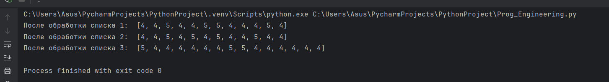

- ## Выводы
Функция fix_grades принимает список оценок и возвращает новый список, где все оценки '2' заменены на '4', а оценки '3' на '4'. В исходном коде есть три списка (list1, list2, list3), каждый из которых содержит различные наборы оценок. После применения функции fix_grades к каждому списку результаты печатаются для сравнения.

## Самостоятельная работа №5
### Вам предоставлены списки натуральных чисеи, из них необходимо сформировать множества. При этом следует соблюдать это правило: если какое-либо число повторяется, то преобразовать его в строку по следующему образцу: например, если число 4 повторяется 3 раза, то в множестве будет следующая запись: само число 4, строка «44», строка «444».

### Множества для теста:

### list_1 = [1, 1,3, 3, 1]
### list_2 = [5, 5, 5, 5, 5, 5,5]
### list_3 =[2,2,1,2,2, 5, 6,7, 1,3,2,2]
### Результаты вывода (порядок может отличаться, поскольку мы работаем с set()):

### {'11', 1,3, '33', '111'}
### {5,'5555', '555555', '55555', '555', '55', '5555555'}
### {'11', 1,3, 2, 5, 6, '222222', '222', 7, '2222', '22222', '22'}
```python
import math

def main(a, b, c):
    s = (a + b + c) / 2
    area = math.sqrt(s * (s - a) * (s - b) * (s - c))
    return area

from Prog_Engineering import main

a = float(input("Введите первую сторону треугольника: "))
b = float(input("Введите вторую сторону треугольника: "))
c = float(input("Введите третью сторону треугольника: "))

area = main(a, b, c)
if __name__ == '__main__':
    print(f"Площадь треугольника равна {area}")
```
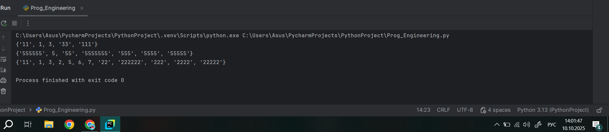

- ## Выводы
Функция set_gen принимает список и возвращает множество, которое содержит элементы исходного списка после обработки. В процессе обработки, для каждого элемента списка проверяется количество его повторений. Если элемент повторяется больше одного раза, то он заменяется на строковое представление себя, умноженное на количество повторений. Например, если элемент встречается три раза, то он заменяется на "3".

## Общие выводы по теме
1. Базовые коллекции представляют собой структуры данных, которые позволяют хранить и организовывать группы элементов. В Python базовые коллекции представлены различными типами данных, такими как списки, кортежи, множества и словари.
2. Списки в Python представляют упорядоченную коллекцию элементов, которые могут быть различных типов данных. Они могут содержать дубликаты элементов и их можно изменять (добавлять, удалять, изменять элементы).
3. Списки обозначаются квадратными скобками [].
4. Кортежи в Python представляют упорядоченную коллекцию элементов, которые также могут быть различных типов данных. Однако, в отличие от списков, кортежи являются неизменяемыми, то есть их элементы не могут быть изменены после создания. Кортежи обозначаются круглыми скобками ().
5. Множества в Python представляют неупорядоченную коллекцию уникальных элементов. Они не поддерживают индексацию элементов и порядок элементов может меняться при итерации. Множества в Python обозначаются фигурными скобками {} или с помощью функции set().
6. Словари в Python представляют неупорядоченную коллекцию пар ключ-значение. Каждый элемент в словаре имеет уникальный ключ, и к нему можно обратиться по ключу для получения значения. Словари в Python обозначаются фигурными скобками {} и используются для хранения и доступа к данным с помощью ключей.
7. Эти базовые коллекции могут быть использованы для различных целей в программировании, в зависимости от требуемых операций и характеристик данных. Python также предлагает более продвинутые коллекции и структуры данных, такие как namedtuple, deque, defaultdict, OrderedDict и другие, которые могут быть использованы для решения конкретных задач.
