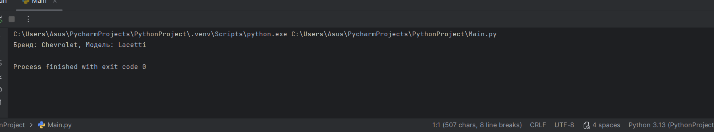
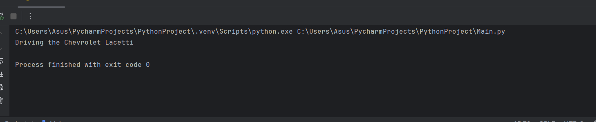
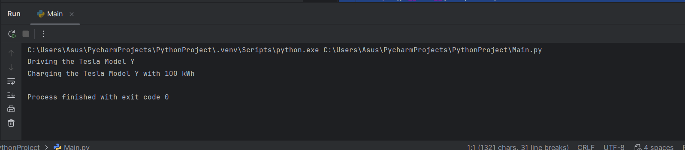
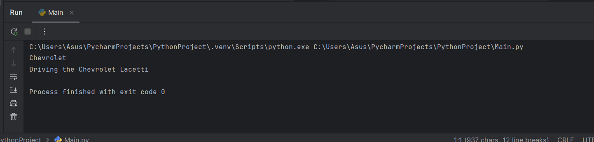
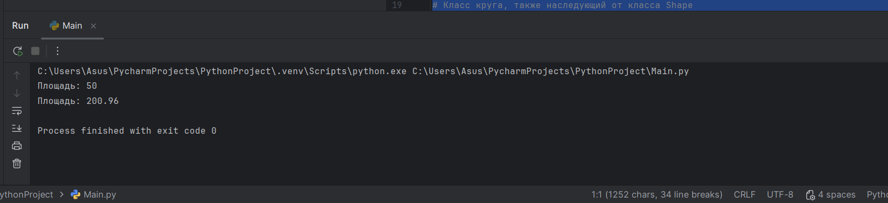
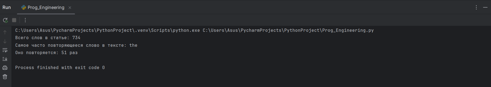
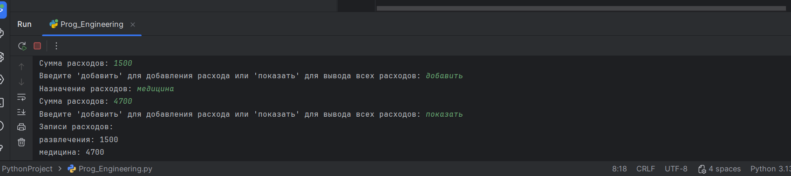
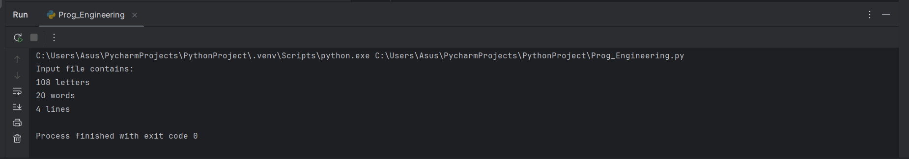
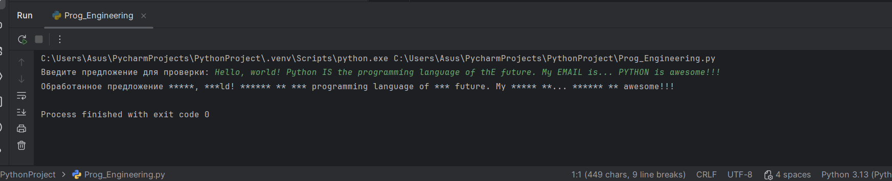
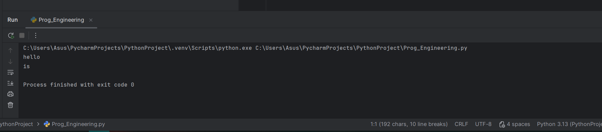

# Тема 8. Введение в ООП
Отчёт по теме выполнила:
  - Пстыга Александра Сергеевна
  - АИС-23-1

| Задание | Лаб_раб | Сам_раб |
| ------ | ------ | ------ |
| Задание 1 | + | + |
| Задание 2 | + | + | 
| Задание 3 | + | + | 
| Задание 4 | + | + |
| Задание 5 | + | + | 

знак "+" - задание выполнено; знак "-" - задание не выполнено;

## Лабораторные задания:

### №1. 
Создайте класс "Car" с атрибутами производитель и модель. Создайте объект этого класса. Напишите компоненты для кода, объясняющие его работу. Результатом выполнения задания будет листинг кода с компонентами.
### Ответ (текст внутри файла):
```python
class Car:  # Определение класса 'Car'
    def __init__(self, make, model):  # Метод инициализации экземпляра класса
        self.make = make  # Присваивание значения параметра 'make' атрибуту 'make' объекта
        self.model = model  # Присваивание значения параметра 'model' атрибуту 'model' объекта

# Создание экземпляра класса 'Car' с параметрами 'Chevrolet' и 'Lacetti'
my_car = Car("Chevrolet", "Lacetti")
# Вывод информации об автомобиле на экран
print(f"Бренд: {my_car.make}, Модель: {my_car.model}")
```


### Вывод: 
В этом коде определяется класс Car, который представляет автомобиль. У класса есть конструктор __init__, принимающий два параметра: марку автомобиля (make) и модель (model). Эти параметры сохраняются в соответствующих атрибутах экземпляра класса. Затем создается объект my_car класса Car с параметрами "Chevrolet" и "Lacetti". В конце выводится информация о бренде и модели этого автомобиля.

### №2. 
Дополните код из первого задания, добавив в него атрибуты и методы класса, заставьте машину “поехать”. Напишите комментарии для кода, объясняющие его работу. Результатом выполнения задания будет листинг кода с комментариями и получившийся вывод в консоль.
### Ответ: 
```python
# Определение класса Car
class Car:
    # Метод инициализации, который вызывается при создании нового экземпляра класса
    def __init__(self, make, model):
        # Сохранение марки автомобиля в атрибуте 'make'
        self.make = make
        # Сохранение модели автомобиля в атрибуте 'model'
        self.model = model

    # Метод для имитации вождения автомобиля
    def drive(self):
        # Вывод сообщения о вождении текущего автомобиля
        print(f"Driving the {self.make} {self.model}")

# Создание экземпляра класса Car с маркой Chevrolet и моделью Lacetti
my_car = Car("Chevrolet", "Lacetti")
# Вызов метода drive у созданного экземпляра my_car
my_car.drive()
```


### Вывод: 
В данном коде создается класс Car, который представляет автомобиль. У класса есть два атрибута: марка (make) и модель (model), которые задаются при инициализации экземпляра через метод __init__. Также у класса есть метод drive, который выводит сообщение о том, что автомобиль движется. В конце кода создается экземпляр класса Car для автомобиля марки Chevrolet модели Lacetti, после чего вызывается метод drive.

### №3. 
Создайте новый класс “ElectricCar” с методом “charge” и атрибутом емкость батареи. Реализуйте его наследование от класса, созданного в первом задании. Заставьте машину поехать, а потом заряжаться. Напишите комментарии для кода, объясняющие его работу. Результатом выполнения задания будет листинг кода с комментариями и получившийся вывод в консоль.
### Ответ: 
```python
# Определение класса Car, который представляет автомобиль
class Car:
    # Метод инициализации экземпляра класса Car
    def __init__(self, make, model):
        # Сохранение марки автомобиля в атрибуте 'make'
        self.make = make
        # Сохранение модели автомобиля в атрибуте 'model'
        self.model = model
    # Метод для управления автомобилем
    def drive(self):
        # Вывод сообщения о вождении автомобиля
        print(f"Driving the {self.make} {self.model}")

# Класс ElectricCar, наследующий от класса Car
class ElectricCar(Car):
    # Метод инициализации экземпляра класса ElectricCar
    def __init__(self, make, model, battery_capacity):
        # Вызов метода инициализации родительского класса Car
        super().__init__(make, model)
        # Сохранение емкости батареи в атрибуте 'battery_capacity'
        self.battery_capacity = battery_capacity
    # Метод зарядки электромобиля
    def charge(self):
        # Вывод сообщения о зарядке электромобиля
        print(f"Charging the {self.make} {self.model} with {self.battery_capacity} kWh")

# Создание экземпляра класса ElectricCar
my_electric_car = ElectricCar("Tesla", "Model Y", 100)
# Вызов метода вождения для созданного экземпляра
my_electric_car.drive()
# Вызов метода зарядки для созданного экземпляра
my_electric_car.charge()
```


### Вывод: 
В данном коде реализованы два класса: Car и ElectricCar. Класс Car представляет собой базовый класс для автомобиля, который имеет марку (make) и модель (model), а также метод drive, который выводит сообщение о вождении данного автомобиля. Класс ElectricCar является наследником от Car, добавляет параметр батареи (battery_capacity) и метод charge, который позволяет зарядить электромобиль. В конце кода создается экземпляр ElectricCar, вызываются методы drive и charge.

### №4. 
Реализуйте инкапсуляцию для класса, созданного в первом задании. Создайте защищенный атрибут производителя и приватный атрибут модели. Вызовите защищенный атрибут и заставьте машину поехать. Напишите комментарии для кода, объясняющие его работу. Результатом выполнения задания будет листинг кода с комментариями и получившийся вывод в консоль.
### Ответ: 
```python
with open ('Task') as f:
    print(f.readlines())
```


### Вывод: 
Этот код открывает файл Task для чтения и затем выводит все строки этого файла. В результате выполнения этого кода будет выведен список строк, содержащихся в файле input.txt.

### №5. 
Напишите программу, которая выведет каждую строку из вашего файла отдельно, при этом используйте конструкцию with open().
### Ответ: 
```python
with open ('Task') as f:
    for line in f:
        print(line)
```

### Вывод: 
Этот код открывает файл Task для чтения и обрабатывает каждую строку этого файла. Для каждой строки вызывается функция print(), которая выводит эту строку на экран.


## Самостоятельные задания:

### №1. 
Найдите в интернете любую статью (объем статьи не менее 200 слов), скопируйте ее содержимое в файл и напишите программу, которая считает количество слов в текстом файле и определит самое часто встречающееся слово. Результатом выполнения задачи будет: скриншот файла со статьей, листинг кода, и вывод в консоль, в котором будет указана вся необходимая информация.
### Ответ: 
```python
def number_of_words(file):
    words = []
    summa = []
    word_count = {}

    with open(file, 'r', encoding='utf-8') as f:
        for line in f:
            line = line.lower().split()
            len_of_line = len(line)
            words.append((line, len_of_line))

            for word in line:
                if word in word_count:
                    word_count[word] += 1
                else:
                    word_count[word] = 1
        for i, v in words:
            summa.append(v)
        print(f'Всего слов в статье: {sum(summa)}')
    word_with_maximus = max(word_count, key=word_count.get)
    maximus = max(word_count.values())
    print(f'Cамое часто повторяющееся слово в тексте: {word_with_maximus}\nОно повторяется: {maximus} раз')
number_of_words('Task')
```


### Вывод: 
Функция number_of_words принимает файл file в качестве аргумента и выполняет следующие шаги:

1. Открывает файл для чтения в кодировке UTF-8.
2. Проходит по каждой строке и преобразует её в нижний регистр, после чего разбивает на отдельные слова.
3. Для каждого слова проверяет, есть ли оно уже в словаре word_count, и обновляет счётчик этого слова.
4. Сохраняет длину каждой строки в список summa.
5. Выводит количество всех слов в статье.
6. Определяет самое часто встречающееся слово и количество его повторений.
7. Печатает информацию о самом частом слове и количестве его повторений.
   
### №2. 
У вас появилась потребность в ведении книги расходов, посмотрев все существующие варианты вы пришли к выводу что вас ничего не устраивает и нужно все делать самому. Напишите программу для учета расходов. Программа должна позволять вводить информацию о расходах, сохранять ее в файл и выводить существующие данные в консоль. Ввод информации происходит через консоль. Результатом выполнения задачи будет: скриншот файла с учетом расходов, листинг кода, и вывод в консоль, с демонстрацией работоспособности программы.
### Ответ: 
```python
def add_expense():
    description = input("Назначение расходов: ")
    amount = input("Сумма расходов: ")
    with open('s2.txt', 'a', encoding='utf-8') as file:
        file.write(f'{description}: {amount}\n')
def show_expenses():
    print("Записи расходов:")
    with open('s2.txt', 'r', encoding='utf-8') as file:
        for line in file:
            print(line.strip())
while True:
    action = input("Введите 'добавить' для добавления расхода или 'показать' для вывода всех расходов: ").strip()
    if action.lower() == 'добавить':
        add_expense()
    elif action.lower() == 'показать':
        show_expenses()
    else:
        print("Неверный ввод. Попробуйте снова.")
```


### Вывод: 
Этот код на Python позволяет пользователю добавлять и просматривать записи о расходах. Функция add_expense принимает назначение расходов и сумму через стандартный ввод и записывает их в файл s2.txt. Функция show_expenses считывает содержимое этого файла и выводит его на экран. Основной цикл предоставляет выбор между действиями 'добавить' и 'показать'.

### №3. 
Имеются файл input.txt с текстом на латинице. Напишите программу, которая выводит следующую статистику по тексту: количество букв латинского алфавита; число слов; число строк.
- Текст в файле:
Beautiful is better than ugly.
Explicit is better than implicit.
Simple is better than complex.
Complex is better than complicated.
- Ожидаемый результат:
Input file contains:
108 letters
20 words
4 lines
### Ответ: 
```python
def text_statistics(filename):
    with open(filename, 'r', encoding='utf-8') as file:
        text = file.read()
    letters_count = sum(c.isalpha() for c in text)
    words_count = len(text.split())
    lines_count = text.count('\n') + 1
    print(f"Input file contains:")
    print(f"{letters_count} letters")
    print(f"{words_count} words")
    print(f"{lines_count} lines")
text_statistics('Task')
```


### Вывод: 
Функция text_statistics принимает на вход имя файла и возвращает количество букв, слов и строк в этом файле. Она использует метод file.read() для чтения содержимого файла, а затем применяет несколько операций для подсчета соответствующих значений. После этого результаты выводятся на экран.

### №4. 
Напишите программу, которая получает на вход предложение, выводит его в терминал, заменяя все запрещенные слова звёздочками (* количество звёздочек равно количеству букв в слове). Запрещенные слова, разделенные символом пробела, хранятся в текстовом файле input.txt. Все слова в этом файле записаны в нижнем регистре. Программа должна заменить запрещенные слова, где бы они ни встретились, даже в середине другого слова. Замена производится независимо от регистра: если файл input.txt содержит следующее слово exam, то слова экзамен, Exam, ExaM, EXAM и exAm должны быть замены на ****.
- Запрещенные слова:
hello email python the exam wor is
- Предложение для проверки:
Hello, world! Python IS the programming language of thE future. My EMAIL is... PYTHON is awesome!!!
- Ожидаемый результат:
 hello    the   is
*****, ***ld! ****** ** *** programming language of *** future. My ***** **... ****** ** awesome!!!

### Ответ: 
```python
import re
def censor_text(input_text, banned_words):
    for word in banned_words:
        input_text = re.sub(word, '*' * len(word), input_text, flags=re.IGNORECASE)
    return input_text
with open('Task', 'r', encoding='utf-8') as file:
    banned_words = file.read().strip().split()
sentence = input("Введите предложение для проверки: ")
censored_sentence = censor_text(sentence, banned_words)
print('Обработанное предложение', censored_sentence)
```


### Вывод: 
Функция censor_text принимает два аргумента: строку Task и список запрещенных слов banned_words. Она использует регулярное выражение для поиска каждого слова из списка banned_words в строке input_text, заменяет каждое найденное слово символами '*' в количестве, равном длине этого слова, и возвращает измененную строку. Входная строка читается из файла input.txt, который содержит список запрещенных слов. Затем пользователь вводит предложение, которое обрабатывается функцией censor_text, и результат отображается на экране.

### №5. 
Самостоятельно придумайте и решите задачу, которая будет взаимодействовать с текстовым файлом.
#### Задача: Вывести первое и последнее слово из файла.

### Ответ: 
```python
with open('Task', 'r') as file:
    lines = file.readlines()

content = ' '.join(lines)
words = content.split()

first_word = words[0]
last_word = words[-1]

print(first_word)
print(last_word)
```


### Вывод: 
Код открывает файл Task для чтения, читает все строки и сохраняет их в список lines. Затем он объединяет все строки в одну строку, используя пробелы между ними, и сохраняет результат в переменную content. Далее он разбивает эту строку на отдельные слова и сохраняет их в список words. После этого код получает первое слово списка words и последнее слово, затем выводит их на экран.

## Общий вывод по теме: 

- Основные операции с файлами:
1. Открытие файла (функция open())
2. Чтение из файла (методы read(), readline(), readlines())
3. Запись в файл (метод write())
4. Добавление в файл (режим "a")
5. Закрытие файла (метод close())
- Режимы доступа к файлу:
1. "r" - чтение
2. "w" - запись
3. "a" - добавление
4. "b" - бинарный режим
5. "t" - текстовый режим
6. "+" - чтение/запись
- Рекомендуемые практики:
1. Использование конструкции with open() для автоматического закрытия файла2.
2. Обработка исключений при работе с файлами (try-except-finally)
3. Правильное закрытие файлов после использования
- Методы работы с содержимым:
1. readline() - чтение одной строки
2. readlines() - чтение всех строк в список
3. write() - запись данных
4. seek(), tell() - управление указателем чтения/записи
5. flush() - принудительная запись буфера

Правильная работа с файлами важна для избежания утечки ресурсов и обеспечения корректной обработки данных в программе.
