# Тема 4. Базовые операции языка Python
Отчет по Теме #4 выполнил(а):
- Пстыга Александра Сергеевна
- АИС-23-1

| Задание | Лаб_раб | Сам_раб |
| ------ | ------ | ------ |
| Задание 1 | + | + |
| Задание 2 | + | + |
| Задание 3 | + | + |
| Задание 4 | + | + |
| Задание 5 | + | + |
| Задание 6 | + |
| Задание 7 | + |
| Задание 8 | + |
| Задание 9 | + | 
| Задание 10 | + |

знак "+" - задание выполнено; знак "-" - задание не выполнено;


## Лабораторная работа №1
### Напишите функцию, которая выполняет любые арифметические действия и выводит результат в консоль. Вызовите функцию используя “точку входа”.

```python
def main():
    print(2+2)

if __name__ == '__main__':
    main()
```
### Результат.
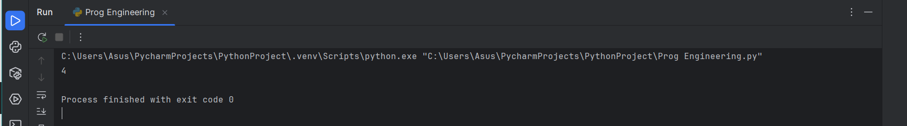

## Выводы

1. В первых двух строках вводятся с клавиатуры значения переменных
2. В третьей строке введенные значения сравниваются
3. Исходя из второго пункта выходит вывод

## Лабораторная работа №2
### Напишите функцию, которая выполняет любые арифметические действия, возвращает при помощи return значение в место, откуда вызывали функцию. Выведите результат в консоль. Вызовите функцию используя “точку входа”.
```python
def main():
    return 2+2

if __name__ == '__main__':
    print(main())
```
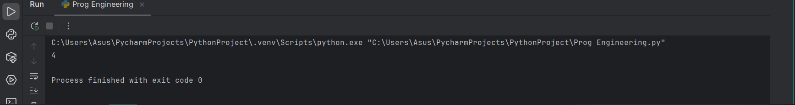

## Выводы

1. Вводится переменная с клавиатуры
2. Далее она прогоняется по условиям чтобы узнать в каком она диапазоне
3. Выходит вывод по диапазону

## Лабораторная работа №3
### Напишите функцию, в которую передаются два аргумента, над ними производится арифметическое действие, результат возвращается туда, откуда эту функцию вызывали. Выведите результат в консоль. Вызовите функцию в любом небольшом цикле. На скриншоте ниже приведен пример программы, в которой аргумент функции “x“превращается в параметр “one”, то же самое происходит с “y” и “two"
def main(one, two):
    result = one + two
    return result

for i in range(5):
    x = 1
    y = 10
    answer = main(x, y)
    print(answer)
```
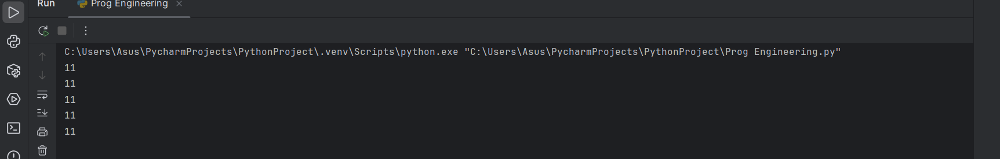

## Выводы
1. Сперва вводится массив, с которым будут сравниваться переменные
2. Ввод переменной с клавиатуры
3. Сравнение чисел массива с переменной
4. Выход вывода
  
## Лабораторная работа №4
### Напишите функцию, на вход которой подается какое-то изначальное неизвестное количество аргументов, над которыми будет производится арифметические действия. Для выполнения задания необходимо использовать кортеж “*args”. На скриншоте ниже приведен пример такой программы с комментариями. Для закрепления понимания работы с кортежами настоятельно рекомендуем поменять аргументы вызова функции, вручную посчитать результат, только потом запустить программу с новыми значениями и проверить себя, насколько вы поняли данный аспект программирования.
```python
def main(x, *args):
    one = x #10
    two = sum(args)
    three = float(len(args))
    print(f"one={one}\ntwo={two}\nthree={three}")
    return x + sum(args) / float(len(args))

if __name__ == '__main__':
    result = main(10, 0, 1, 2, -1, 0, -1, 1, 2)
    print(f"\nresult={result}")
```
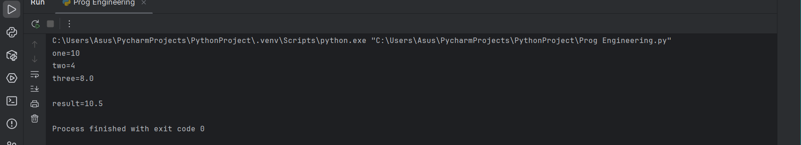

## Выводы
1. Сперва вводится массив, с которым будут сравниваться переменные
2. Ввод переменной с клавиатуры
3. Сравнение чисел массива с переменной
4. Если переменная четная или нечетная это влияет на вывод
5. Выход вывода

## Лабораторная работа №5
### Напишите функцию, которая на вход получает кортеж “**kwargs” и при помощи цикла выводит значения, поступившие в функцию. На скриншоте ниже указаны два варианта вызова функции с “**kwargs” и два варианта работы с данными, поступившими в эту функцию. Комментарии в коде и теоретическая часть помогут вам разобраться в этом нелегком аспекте. Вызовите функцию используя “точку входа”.
```python
def main(**kwargs):
    for i in kwargs.items():
        print(i[0], i[1])
    print()

for key in kwargs:
    print(f"{key} = {kwargs[key]}")

if __name__ == '__main__':
    main(x = [1, 2, 3], y =[3, 3, 0], z=[2, 3, 0], q=[3, 3, 0], w=[3, 3, 0])
    print()
    main(**{'x': [1, 2, 3], 'y': [3, 3, 0]})
```
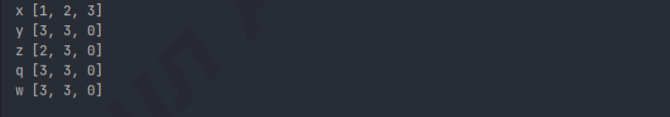

## Выводы
1. Для каждого значения до 10 заводим цикл
2. Проходим цикл и сравниваем получающееся число с условиями
3. в зависимости от подошедшего условия выводим ответ

## Лабораторная работа №6
### Напишите две функции. Первая – получает в виде параметра “**kwargs”. Вторая считает среднее арифметическое из значений первой функции. Вызовите первую функцию используя “точку входа” и минимум 4 аргумента.
```python
def main(**kwargs):
    for i, j in kwargs.items():
        print(f"{i}. Mean = {mean(j)}")
    print()

def mean(data):
    return sum(data) / float(len(data))

if __name__ == '__main__':
    main(x=[1, 2, 3], y=[3, 3, 0])
```
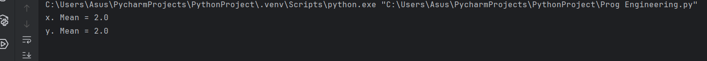

## Выводы
1. Вводим текст для работы
2. Вводим нужную буквы с клавиатуры
3. Сравниваем каждую букву в тексте с нужно
4. Выходит вывод

## Лабораторная работа №7
### Создайте дополнительный файл .py. Напишите в нем любую функцию, которая будет что угодно выводить в консоль, но не вызывайте ее в нем. Откройте файл main.py, импортируйте в него функцию из нового файла и при помощи “точки входа” вызовите эту функцию.
```python
def Hii():
    print("Hii")

from HIHI import Hii
if __name__ == '__main__':
    Hii()
```
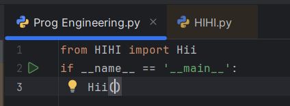
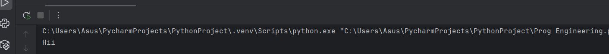

## Выводы
1. Вводим максимальное число
2. Означаем шаг и способ хода
3. Печатаем вывод - все числа и значение

## Лабораторная работа №8
### Напишите программу, которая будет выводить корень, синус, косинус полученного от пользователя числа.
```python
import math

def main():
    value = int(input("Введите значение: "))
    print(math.sqrt(value))
    print(math.sin(value))
    print(math.cos(value))
if __name__ == '__main__':
    main()
```
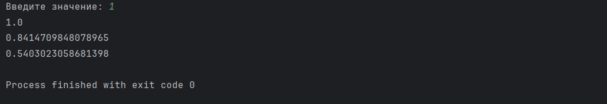

## Выводы
1. Для работы кодда необходимо поменять 2 и 1
2. Проходим по условиям
3. Вывод

## Лабораторная работа №9
### Напишите программу, которая будет рассчитывать какой день недели будет через n-нное количество дней, которые укажет пользователь.
```python
from datetime import datetime as dt
from datetime import timedelta as td

def main():
    print(
        f"Сегодня {dt.today().date()}."
        f"День недели {dt.today().isoweekday()}."
    )
    n = int(input("Введите количество дней: "))
    today = dt.today()
    result = today + td(days=n)
    print(
        f"Через {n} дней будет {result.date()}."
        f"Днеь недели - {result.isoweekday()}."
    )

if __name__ == '__main__':
    main()
```
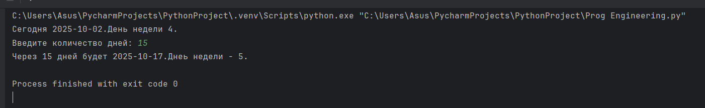

## Выводы
1. Заводим первый цикл, а потом также и вложенный в него
2. Обозначаем условия, при которых переменные не могут быть одинаковыми
3. Выводим ответ

## Лабораторная работа №10
### Напишите программу с использованием глобальных переменных, которая будет считать площадь треугольника или прямоугольника в зависимости от того, что выберет пользователь. Получение всей необходимой информации реализовать через input(), а подсчет площадей выполнить при помощи функций. Результатом программы будет число, равное площади необходимой фигуры
global result

def rectangle():
    a = float(input("Ширина: "))
    b = float(input("Высота: "))
    global result
    result = a * b
def triangle():
    a = float(input("Основание: "))
    h = float(input("Высота: "))
    global result
    result = 0.5 * a * h

figure = input("1-прямоугольник, 2-треугольник: ")
if figure == '1':
    rectangle()
elif figure == '2':
    triangle()

print(f"Площадь: {result}")
```
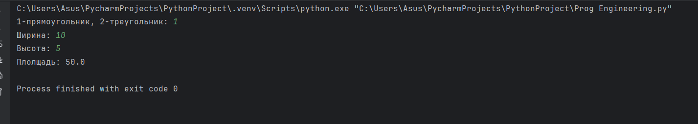

## Выводы
1. Строка при выводе благодаря line[] внутри print() позволяет вывести только символы или слова с указанным в скобках номером

## Самостоятельная работа №1
### Дайте подробный комментарий для кода, написанного ниже. Комментарий нужен для каждой строчки кода, нужно описать что она делает. Не забудьте, что функции комментируются по-особенному.
```python
for i in range(10):
    i *= 5
    if i == 30:
        i += 1
        break
print(i)
```
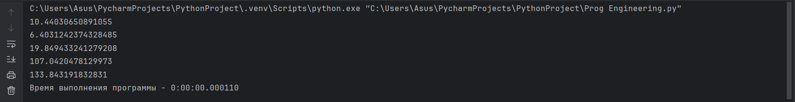

- ## Выводы
1. Заводим цикл, а него вкладываем первое условие
2. При достижении числа 30, заканчиваем предыдущую операцию
3. Прибавляем единицу и выводим ответ
  
## Самостоятельная работа №2
### Напишите программу, которая будет заменять игральную кость с 6 гранями. Если значение равно 5 или 6, то в консоль выводится «Вы победили», если значения 3 или 4, то вы рекурсивно должны вызвать эту же функцию, если значение 1 или 2, то в консоль выводится «Вы проиграли». При этом каждый вызов функции необходимо выводить в консоль значение “кубика”. Для выполнения задания необходимо использовать стандартную библиотеку random. Программу нужно написать, используя одну функцию и “точку входа”
line = reversed('Hello world')
for i in line:
    print(i)
```
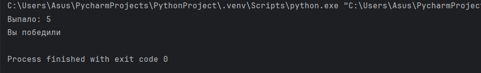

- ## Выводы
1. Вводим нужный текст, обращаем перевернутую в переменную
2. Выводим по отдельности каждую букву в разных строках
  
## Самостоятельная работа №3
### Напишите программу, которая будет выводить текущее время, с точностью до секунд на протяжении 5 секунд. Программу нужно написать с использованием цикла. Подсказка: необходимо использовать модуль datetime и time, а также вам необходимо как-то “усыплять” программу на 1 секунду.
```python
number = int(input())
if 0 < number <= 3:
    print ('Число в диапазоне от 0 до 3')
elif 3 < number < 6:
    print('Число в диапазоне от 3 до 6')
elif 6 <= number <= 10:
    print('Число в диапазоне от 6 до 10')
else:
    print('Число не входит в нужный диапазон')
```
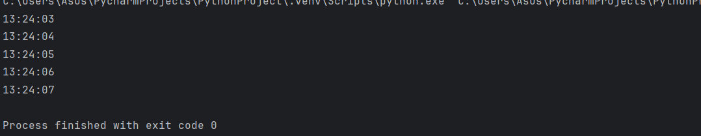

- ## Выводы
1. Вводится переменная с клавиатуры
2. Далее она прогоняется по условиям чтобы узнать в каком она диапазоне
3. Выходит вывод по диапазону
  
## Самостоятельная работа №4
### Напишите программу, которая считает среднее арифметическое от аргументов вызываемое функции, с условием того, что изначальное количество этих аргументов неизвестно. Программу необходимо реализовать используя одну функцию и “точку входа”.
```python
text = input()
print("Длина текста - ", len(text))
print("Текст в нижнем регистре - ", text.lower())
count = 0
for i in text:
    if i == 'i' or i == 'o' or i == 'a' or i == 'e' or i == 'u':
        count += 1
print("Количество гласных - ", count)
text.replace("ugly", "beauty")
print("Измененный текст - ", text)
if text[::3] == "The" and text[::-3] == "end":
    print ('Хороший текст')
else:
    print('Тоже хорошй, но не такой хороший текст')
```
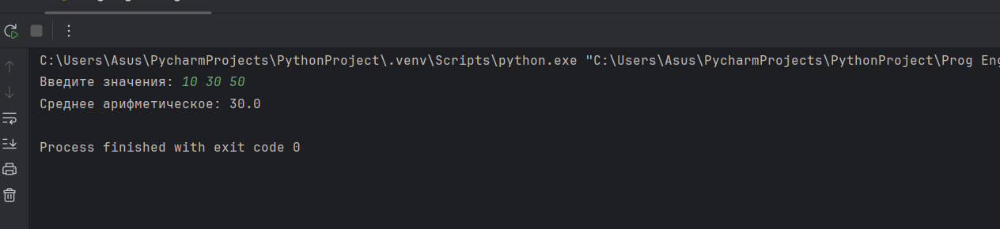

- ## Выводы
1. Строка при выводе благодаря *3 внутри print() позволяет вывести указанную строку не один раз, а три. Так как длина первоначальной строки 5, то длина выведенной строки 15
  
## Самостоятельная работа №5
### Создайте два Python файла, в одном будет выполняться вычисление площади треугольника при помощи формулы Герона (необходимо реализовать через функцию), а во втором будет происходить взаимодействие с пользователем (получение всей необходимой информации и вывод результатов). Напишите эту программу и выведите в консоль полученную площадь.
```python
text = 'hello world'
count = 0

for j in text:
    count += 1
    if count % 2 == 1:
        print(text)
    else:
        print(text[:5])
```
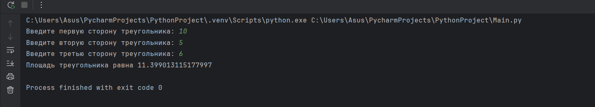

- ## Выводы
1. С помощью строки from datetime import datetime; импортируем из библиотеки необходимую для задания функцию

2. Второй строкой вызываем по очереди день (datetime.now().day), месяц значением string (datetime.now().strftime('%B')) и год (datetime.now().year) строкой f. Все это выводится в предложении

## Общие выводы по теме
- Python имеет множество полезных средств для удобной работы со строками и числами. Числа можно преобразовывать в разные типы, бробные, целые и т.д. Такжеможно выполнять все базовые арифметические операции и переводить в разные системы счисления. Работа с текстом включает огромное множество различных средств, в том числе и для работы с объемными текстами.
