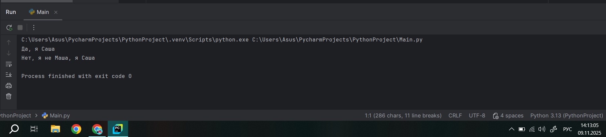
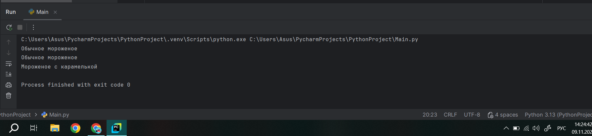
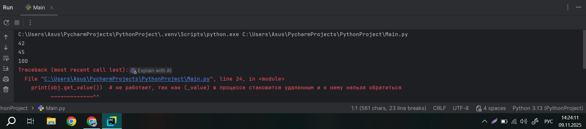
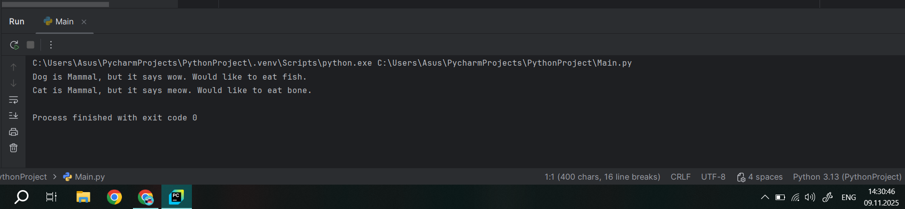
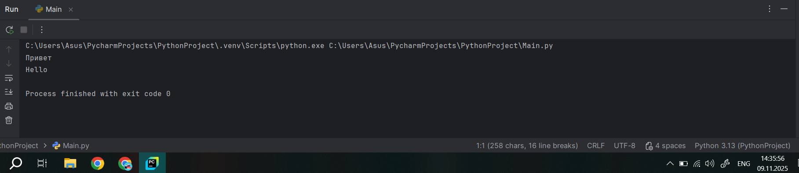
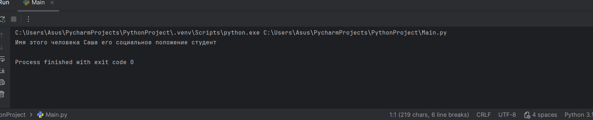
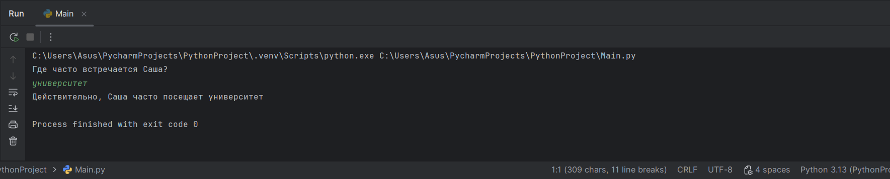
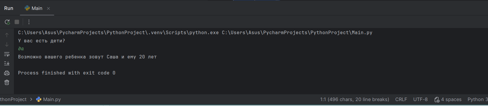
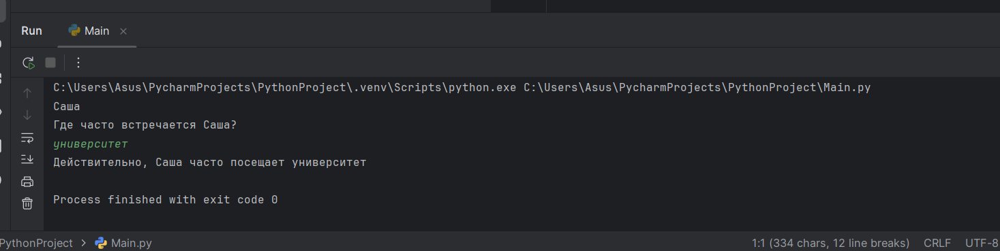
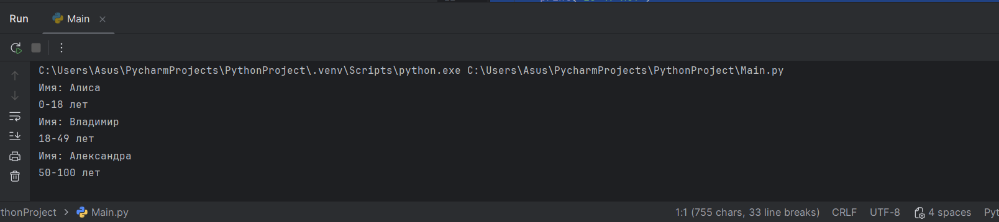

# Тема 9. Концепции и принципы ООП
Отчёт по теме выполнила:
  - Пстыга Александра Сергеевна
  - АИС-23-1

| Задание | Лаб_раб | Сам_раб |
| ------ | ------ | ------ |
| Задание 1 | + | + |
| Задание 2 | + | + | 
| Задание 3 | + | + | 
| Задание 4 | + | + |
| Задание 5 | + | + | 

знак "+" - задание выполнено; знак "-" - задание не выполнено;

## Лабораторные задания:

### №1. 
Допустим, что вы решили оригинально и немного странно познакомится с человеком. Для этого у вас должен быть написан свой класс на Python, который будет проверять угадал ваше имя человек или нет. Для этого создайте класс, указав в свойствах только имя. Дальше создайте функцию init (), а в ней сделайте проверку на то угадал человек ваше имя или нет. Также можете проверить что будет, если в этой функции указав атрибут, который не указан в вашем классе, например, попробуйте вызвать фамилию.
### Ответ:
```python
class Name:
    __slots__ = ["name"]
    def __init__(self, name):
        if name == "Саша":
            self.name = f"Да, я {name}"
        else:
            self.name = f"Нет, я не {name}, я Саша"

person1 = Name("Саша")
person2 = Name("Маша")
print(person1.name)
print(person2.name)
```


### Вывод: 
В этом коде создается класс Name с использованием механизма __slots__, который ограничивает доступные атрибуты класса одним полем name. В конструкторе класса происходит проверка имени: если оно равно "Саша", то атрибуту name присваивается строка "Да, я Саша"; иначе — "Нет, я не {имя}, я Саша".
При создании объектов person1 и person2 и их последующей печати мы увидим разные результаты в зависимости от переданного имени.

### №2. 
Вам дали важное задание, написать продавцу мороженого программу, которая будет писать добавили ли топпинг в мороженое и цену после возможного изменения. Для этого вам нужно написать класс, в котором будет определяться изменили ли состав мороженого или нет. В этом классе реализуйте метод, выводящий на печать «Мороженое с {ТОППИНГ}» в случае наличия добавки, а иначе отобразится следующая фраза: «Обычное мороженое». При этом программа должна воспринимать как топпинг только атрибуты типа string.
### Ответ: 
```python
class IceCream:
    def __init__(self, ingredient=None):
        if isinstance(ingredient, str):
            self.ingredient = ingredient
        else:
            self.ingredient = None

    def composition(self):
        if self.ingredient:
            print(f'Мороженое с {self.ingredient}')
        else:
            print('Обычное мороженое')


icecream = IceCream()
icecream.composition()
icecream = IceCream()
icecream.composition()
icecream = IceCream("карамелькой")
icecream.composition()
```


### Вывод: 
Класс IceCream представляет собой модель мороженого, которая может содержать ингредиент или быть обычной. Метод composition() выводит информацию о составе мороженого. В примере создаются три экземпляра класса: одно мороженое с карамелью и два обычных.

### №3. 
Петя – начинающий программист и на занятиях ему сказали реализовать икапсу…что-то. А вы хороший друг Пети и ко всему прочему прекрасно знаете, что икапсу…что-то – это инкапсуляция, поэтому решаете помочь вашему другу с написанием класса с инкапсуляцией. Ваш класс будет не просто инкапсуляцией, а классом с сеттером, геттером и деструктором. После написания класса вам необходимо продемонстрировать что все написанные вами функции работают.
### Ответ: 
```python
class Main:
    def __init__(self, value):
        self._value = value

    def set_value(self, value):
        self._value = value

    def get_value(self):
        return self._value

    def del_value(self):
        del self._value

    value = property(get_value, set_value, del_value, "Свойство value")


obj = Main(42)
print(obj.get_value())
obj.set_value(45)
print(obj.get_value())
obj.set_value(100)
print(obj.get_value())
obj.del_value()
print(obj.get_value())  # не работает, так как (_value) в процессе становится удаленным и к нему нельзя обратиться
```


### Вывод: 
В этом коде создается класс Main, который имеет приватный атрибут _value для хранения значения. Методы get_value(), set_value() и del_value() используются для получения, установки и удаления этого атрибута соответственно. Эти методы связаны со свойством value через декоратор property. В конце кода создаются экземпляры класса и выполняются различные операции с ними. Последняя строка вызывает ошибку, так как после вызова метода del_value(), атрибут _value удаляется, и попытка получить значение приводит к исключению.


### №4. 
Вам прекрасно известно, что кошки и собаки являются млекопитающими, но компьютер этого не понимает, поэтому вам нужно написать три класса: Кошки, Собаки, Млекопитающие. И при помощи “наследования” объяснить компьютеру что кошки и собаки – это млекопитающие. Также добавьте какой-нибудь свой атрибут для кошек и собак, чтобы показать, что они чем-то отличаются друг от друга.
### Ответ: 
```python
class Mammal:
    className = "Mammal"

class Dog(Mammal):
    species = "canine"
    sounds = "wow"
    eat = "fish"

class Cat(Mammal):
    species = "feline"
    sounds = "meow"
    eat = "bone"

dog = Dog()
print(f"Dog is {dog.className}, but it says {dog.sounds}. Would like to eat {dog.eat}.")
cat = Cat()
print(f"Cat is {cat.className}, but it says {cat.sounds}. Would like to eat {cat.eat}.")
```


### Вывод: 
В этом коде демонстрируется использование наследования в Python. Класс Mammal является базовым классом для классов Dog и Cat. Оба подкласса наследуют атрибут className, а также определяют свои собственные атрибуты (species, sounds, eat), характеризующие поведение собак и кошек соответственно. В конце кода создаются экземпляры классов Dog и Cat, после чего их характеристики выводятся на экран.

### №5. 
На разных языках здороваются по-разному, но суть остается одинаковой, люди друг с другом здороваются. Давайте вместе с вами реализуем программу с полиморфизмом, которая будет описывать всю суть первого предложения задачи. Для этого мы можем выбрать два языка, например, русский и английский и написать для них отдельные классы, в которых будет в виде атрибута слово, которым здороваются на этих языках. А также напишем функцию, которая будет выводить информацию о том, как на этих языках здороваются. Заметьте, что для решения поставленной задачи мы использовали декоратор @staticmethod, поскольку нам не нужны обязательные параметры-ссылки вроде self.
### Ответ: 
```python
class Russian:
    @staticmethod
    def greeting():
        print("Привет")

class English:
    @staticmethod
    def greeting():
        print("Hello")

def greet(language):
    language.greeting()

ivan = Russian()
greet(ivan)
john = English()
greet(john)
```

### Вывод: 
В данном коде реализованы два класса Russian и English, каждый из которых содержит статический метод greeting(). Метод greet() принимает объект одного из этих классов и вызывает у него метод greeting(), который выводит соответствующее приветствие на нужном языке. Таким образом, программа демонстрирует полиморфизм через использование одинаковых методов в разных классах для выполнения схожих задач.


## Самостоятельные задания:
### №1. 
Самостоятельно создайте класс и его объект. Они должны отличаться, от тех, что указаны в теоретическом материале (методичке) и лабораторных заданиях. Результатом выполнения задания будет листинг кода и получившийся вывод консоли.
### Ответ: 
```python
class Human:
    def __init__(self, name, klass):
        self.name = name
        self.klass = klass

person = Human("Саша", "студент")
print(f'Имя этого человека {person.name} его социальное положение {person.klass}')
```


### Вывод: 
В данном коде создается класс Human, который представляет собой какого-то человека. У класса есть два атрибута: name (имя человека) и klass (класс/социальный статус человека). Затем создается экземпляр этого класса (person), которому присваиваются значения для имени ("Саша") и класса ("Студент"). В конце программа выводит информацию об этом человеке на экран.
   
### №2. 
Самостоятельно создайте атрибуты и методы для ранее созданного класса. Они должны отличаться, от тех, что указаны в теоретическом материале (методичке) и лабораторных заданиях. Результатом выполнения задания будет листинг кода и получившийся вывод консоли.
### Ответ: 
```python
class Human:
    def __init__(self, name, klass):
        self.name = name
        self.klass = klass

    def place(self):
        print(f'Где часто встречается {self.name}?')
        a = input()
        print(f"Действительно, {self.name} часто посещает", a)

person = Human("Саша", "студент")
person.place()
```


### Вывод: 
В данном коде создается класс Human, который представляет собой какого-то человека. У класса есть два атрибута: name (имя человека) и klass (класс/социальный статус человека). Затем создается экземпляр этого класса (person), которому присваиваются значения для имени ("Саша") и класса ("Студент"). В конце программа выводит информацию об этом человеке на экран. Метод place() запрашивает у пользователя информацию о месте, где можно часто встретить этого человека и выводит сообщение, подтверждающее введенное значение. В примере создается объект класса Human, после чего вызывается метод place().

### №3. 
Самостоятельно реализуйте наследование, продолжая работать с ранее созданным классом. Оно должно отличаться, от того, что указано в теоретическом материале (методичке) и лабораторных заданиях. Результатом выполнения задания будет листинг кода и получившийся вывод консоли.
### Ответ: 
```python
class Human:
    def __init__(self, name, klass):
        self.name = name
        self.klass = klass

class Kid(Human):
    def __init__(self, name, age):
        self.name = name
        self.age = age

    def yourKid(self):
        print ("У вас есть дети?")
        a = input()
        if a == "да":
            print(f"Возможно вашего ребенка зовут {self.name} и ему {self.age} лет")
        else:
            print("А с вами мы поговорим позже")


person = Kid("Саша", 20)
person.yourKid()
```


### Вывод: 
В данном коде создается класс Human, который представляет собой какого-то человека. У класса есть два атрибута: name (имя человека) и klass (класс/социальный статус человека). Затем создается экземпляр этого класса (person), которому присваиваются значения для имени ("Саша") и класса ("Студент").

### №4. 
Самостоятельно реализуйте инкапсуляцию, продолжая работать с ранее созданным классом. Она должна отличаться, от того, что указана в теоретическом материале (методичке) и лабораторных заданиях. Результатом выполнения задания будет листинг кода и получившийся вывод консоли.

### Ответ: 
```python
class Human:
    def __init__(self, name, klass):
        self._name = name
        self.__klass = klass

    def place(self):
        print(f'Где часто встречается {self._name}?')
        a = input()
        print(f"Действительно, {self._name} часто посещает", a)

person = Human("Саша", "студент")
print(person._name)
person.place()
```


### Вывод: 
В данном коде создается класс Human, с двумя основными характеристиками: именем (_name) и классом (__klass), который является защищенным полем. Затем создается экземпляр этого класса (person), которому присваиваются значения для имени ("Саша") и класса ("Студент").

### №5. 
Самостоятельно реализуйте полиморфизм. Он должен отличаться, от того, что указан в теоретическом материале (методичке) и лабораторных заданиях. Результатом выполнения задания будет листинг кода и получившийся вывод консоли.

### Ответ: 
```python
class Human:
    def get_name(self):
        pass
    def get_age(self):
        pass

class Kid(Human):
    def __init__(self, name):
        self.name = name
    def get_name(self):
        return self.name
    def get_age(self):
        print("0-18 лет")

class Adult(Human):
    def __init__(self, name):
        self.name = name
    def get_name(self):
        return self.name
    def get_age(self):
        print("18-49 лет")

class Oldy(Human):
    def __init__(self, name):
        self.name = name
    def get_name(self):
        return self.name
    def get_age(self):
        print("50-100 лет")

persons = [Kid("Алиса"), Adult("Владимир"), Oldy("Александра")]
for person in persons:
    print(f"Имя: {person.get_name()}")
    person.get_age()
```


### Вывод: 
В данном коде представлена иерархия классов для описания людей с использованием наследования. Базовый класс Human определяет методы get_name() и get_age(), которые переопределяются в дочерних классах Kid, Adult и Oldy. Каждый подкласс инициализирует имя через конструктор и реализует свои версии методов get_name() и get_age().
Основная часть программы создает список объектов различных персонажей (Kid, Adult, Oldy) и выводит их имена и возраст с помощью цикла.

## Общий вывод по теме: 

Объектно-ориентированное программирование (ООП) представляет собой мощную парадигму программирования, которая организует код вокруг объектов - экземпляров классов. ООП основывается на нескольких ключевых концепциях:

1. Классы и объекты: Классы служат шаблонами для создания объектов, определяя их структуру и поведение.
2. Атрибуты и методы: Атрибуты представляют состояние объекта, а методы - его поведение.
3. Наследование: Позволяет создавать новые классы на основе существующих, способствуя повторному использованию кода и созданию иерархий классов.
4. Инкапсуляция: Обеспечивает сокрытие внутренних деталей реализации класса, предоставляя контролируемый доступ к его компонентам.
5. Полиморфизм: Дает возможность объектам разных классов иметь общий интерфейс, но реагировать на одинаковые операции по-разному.

ООП способствует созданию более модульного, гибкого и понятного кода. Оно позволяет разработчикам абстрагироваться от деталей реализации и сосредоточиться на моделировании объектов и их взаимодействии в программе. Такой подход улучшает структуру кода, облегчает его поддержку и расширение, а также способствует более эффективной организации сложных программных систем.
