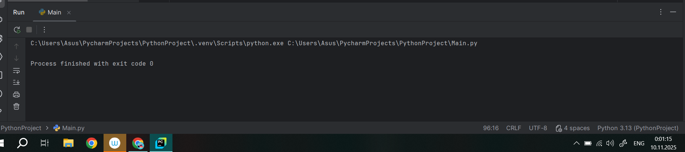
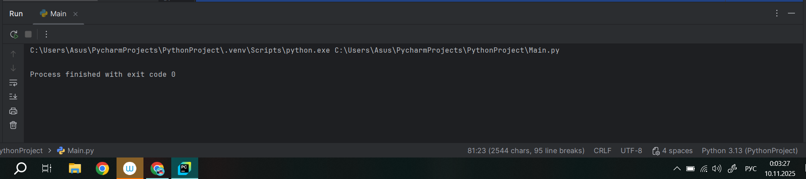
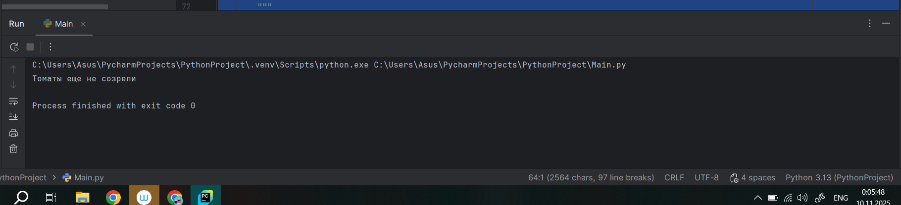

# Тема 10. Декораторы и исключения
Отчёт по теме выполнила:
  - Пстыга Александра Сергеевна
  - АИС-23-1

| Задание | Лаб_раб | Сам_раб |
| ------ | ------ | ------ |
| Задание 1 | + | + |
| Задание 2 | + | + | 
| Задание 3 | + | + | 
| Задание 4 | + | + |
| Задание 5 | + | + | 

знак "+" - задание выполнено; знак "-" - задание не выполнено;

## Лабораторные задания:

### №1. 
Вам нужно написать программу, которая будет считать числа Фибоначчи для 100 и запустить ее без этого декоратора и с ним, посмотреть на разницу во времени решения поставленной задачи. 
P.S. при запуске без декоратора может долго не ждать, для наглядности хватит 10 секунд ожидания.
### Ответ:
```python
from functools import lru_cache

@lru_cache(None)
def fibonacci(n):
    if n == 0:
        return 0
    elif n == 1:
        return 1
    return fibonacci(n - 1) + fibonacci(n - 2)
if __name__ == '__main__':
    print(fibonacci(100))
```


### Вывод: 
Этот код использует декоратор lru_cache для реализации функции вычисления чисел Фибоначчи с использованием мемоизации. В данном случае, при каждом вызове функции результат будет сохраняться в кэше, что позволит избежать повторного вычисления значений для уже известных аргументов.

### №2. 
Илья пишет свой сайт и ему необходимо сделать минимальную проверку входа данных пользователей при регистрации. Для этого он реализовал функцию, которая выводит данные пользователя на экран и решает, что будет проверять правильность введённых данных при помощи детектора, но в этом ему потребовалась ваша помощь. Напишите детектор для функции, который будет принимать все параметры вызываемой функции (имя, возраст) и проверять чтобы возраст был больше 0 и меньше 130. Примечание, что важно сколько пользователь введет данных на сайт к Илье, будут обрабатываться только первые 2 аргумента.
### Ответ: 
```python
def check(input_func):
    def output_func(*args):
        name, age = args[0], args[1]
        if age < 0 or age > 130:
            age = 'Недопустимый возраст'
        input_func(name,age)
    return output_func

@check
def personal_info(name, age):
    print(f"Name: {name} Age: {age}")

if __name__ == '__main__':
    personal_info('Александра', 20)
    personal_info('Екатерина', -5)
    personal_info('Татьяна', 138, 15, 48, 2)
```


### Вывод: 
Код содержит функцию-декоратор check, которая проверяет корректность возраста перед передачей данных в декорируемую функцию. Если возраст выходит за пределы допустимого диапазона (от 0 до 130), он заменяется строковым значением 'Недопустимый возраст'. Основная функция personal_info выводит имя и возраст, а декоратор используется для предварительной проверки значений. В примере демонстрируется работа декоратора при передаче корректных и некорректных значений возраста.

### №3. 
Вам понравилась идея Ильи с сайтом, и вы решили дальше работать вместе с ним. Но вот в вашем проекте появилась проблема, кто-то пытается сломать вашу функцию с получением данных для сайта. Эта функция работает только с данными integer, а какой-то недохакер пытается все сломать и вместо нужного типа данных отправляет string. Воспользуйтесь исключениями, чтобы неподходящий тип данных не ломал ваш сайт. Также дополнительно можете обернуть весь код функции в try/except/finally для того, чтобы программа вас оповестила о том, что выявлена какая-то ошибка или программа успешно выполнена.
### Ответ: 
```python
def data(*args):
    try:
        for i in range(len(*args)):
            try:
                result = (args[0][i] * 15) // 10
                print(result)
            except Exception as ex:
                print(ex)
    except Exception as ex:
        print(ex)
    finally:
        print('Вся информация обработана.')

if __name__ == '__main__':
    data([1, 15, 'Hello', 'i', 'try', 'to', 'crash', 'your', 'site', 38, 41])
```


### Вывод: 
Код определяет функцию data, которая принимает произвольное количество аргументов через оператор распаковки *args. Внутри функции происходит попытка обработать каждый элемент переданного списка. Если элемент является числом, то он умножается на 15 и делится на 10, результат выводится на экран. В случае ошибки при обработке элемента (например, если элемент не число), ошибка перехватывается и выводится сообщение об ошибке. После обработки всех элементов выводится финальное сообщение о завершении работы программы.


### №4. 
Продолжая работу над сайтом, мы решили написать собственное исключение, которое будет вызываться в случае, если в функцию проверки имени при регистрации передана строка длиннее десяти символов, а если имя имеет допустимую длину, то в консоль выводиться "Успешная регистрация".
### Ответ: 
```python
class NegativeValueException(Exception):
    pass

def check_name(name):
    if len(name) > 10:
        raise NegativeValueException("Длина более 10 символов")
    else:
        print('Успешная регистрация')

if __name__ == '__main__':
    name = '12345678910'
    check_name(name)
```


### Вывод: 
В данном коде определяется пользовательское исключение NegativeValueException, которое наследуется от базового класса исключений Exception. Затем создается функция check_name, которая проверяет длину переданного имени: если длина превышает 10 символов, то возбуждается исключение NegativeValueException с сообщением об ошибке, иначе выводится сообщение о успешной регистрации. В основной части программы происходит вызов функции check_name с именем длиной ровно 10 символов.

### №5. 
После запуска сайта вы поняли, что вам необходимо добавить логотерм для отслеживания его работы. Готовыми вариантами вы не воспользовались, и поэтому решили создать очень простую паролину. Для этого создали две функции: init (вызывается при создании класса декоратора в программе) и call_ (вызывается при вызове декоратора). Создайте необходимый вам декоратор. Выведите все логи в консоль.
### Ответ: 
```python
class SiteChecker:
    def __init__(self, func):
        print('> Класс SiteChecker метод __init__ успешный запуск')
        self.func = func
    def __call__(self):
        print('> Проверка перед запуском', self.func.__name__)
        self.func()
        print('> Проверка безопасного включения')
@SiteChecker
def site():
    print('Усердная работа сайта')
if __name__ == '__main__':
    print('>> Сайт запущен')
    site()
    print('>> Сайт выключен')
```

### Вывод: 
В данном коде создается класс SiteChecker, который используется для декорирования функции site(). При инициализации класса SiteChecker выводится сообщение о запуске метода __init__, а также сохраняется ссылка на декорируемую функцию. Метод __call__ позволяет вызывать объект класса как обычную функцию, при этом он выводит сообщения до и после вызова декорированной функции. В результате выполнения кода сначала будет выведено сообщение о проверке перед запуском, затем выполнится функция site() и, наконец, будет выведено сообщение о безопасной проверке завершения работы.


## Самостоятельные задания:
### №1. 
Вовочка решил заняться спортивным программированием на Python, но для этого он должен знать за какое время выполняется его программа. Он решил, что для этого ему идеально подойдет детектор для функции, который будет вычислять за какое время выполнится та или иная функция. Помогите Вовочке в его начинаниях и напишите такой детектор.
Подсказка: необходимо использовать модуль time
Декоратор необходимо использовать для этой функции:
```python
def fibonacci():
    fib1 = fib2 = 1
    
    for i in range(2,200):
        fib1, fib2 = fib1, fib2 + fib2
        print(fib2, end='')
        
if __name__ = '__main__':
    fibonacci()
```
### Ответ: 
```python
import time

def timer(func):
    def wrapper(*args, **kwargs):
        start_time = time.time()
        result = func(*args, **kwargs)
        end_time = time.time()
        total_time = end_time - start_time
        print(f"Время выполнения функции {func.__name__}: {total_time:.4f} секунд")
        return result
    return wrapper

@timer
def fibonacci():
    fib1 = fib2 = 1
    for i in range(2, 200):
        fib1, fib2 = fib1, fib2 + fib2
        print(fib2, end=' ')

if __name__ == "__main__":
    fibonacci()
```


### Вывод: 
В этом коде реализована модель выращивания томатов с помощью классов Tomato, TomatoBush и Gardener. Класс Tomato описывает отдельные плоды, их состояния и методы роста. Класс TomatoBush представляет собой куст томатов, содержащий несколько плодов, и включает методы для управления всеми томатами одновременно. Класс Gardener моделирует садовника, который ухаживает за кустом и собирает урожай при достижении всех томатами зрелого состояния. Код демонстрирует пример использования объектно-ориентированного программирования для моделирования реальной ситуации.
   
### №2. 
Посмотрев на Вовочку, вы также загорелись идеей спортивного программирования, начав тренировки вы узнали, что для решения некоторых задач необходимо считать данные из файлов. Но через некоторое время вы столкнулись с проблемой что файлы бывают пустыми, и вы не получаете вводные данные для решения задач. После этого вы решили не просто считать данные из файла, а всю конструкцию обрабатывать в исключения, чтобы избежать такой проблемы. Создайте пустой файл и файл, в котором есть какая-то информация. Напишите код программы. Если файл пустой, то нужно вывести исключение ("бросить исключение") и вывести в консоль "файл пустой", а если он не пустой, то вывести информацию из файла.
### Ответ: 
```python
class Tomato:

```


### Вывод: 
В этом коде реализована модель выращивания томатов с помощью классов Tomato, TomatoBush и Gardener. Класс Tomato описывает отдельные плоды, их состояния и методы роста. Класс TomatoBush представляет собой куст томатов, содержащий несколько плодов, и включает методы для управления всеми томатами одновременно. Класс Gardener моделирует садовника, который ухаживает за кустом и собирает урожай при достижении всех томатами зрелого состояния. Код демонстрирует пример использования объектно-ориентированного программирования для моделирования реальной ситуации.

### №3. 
Напишите функцию, которая будет складывать 2 и введенное пользователем число, но если пользователь введет строку или другой неподходящий тип данных, то в консоль выводится ошибка "Неподходящий тип данных. Ожидалось число.". Реализовать функциональную программу необходимо через try/except и подобрать правильный тип исключения. Создать собственное исключение нельзя. Проведите несколько тестов, в которых исключение вызывается и нет. Результатом выполнения задачи будет листинг кода и полученный вывод в консоль.
### Ответ: 
```python
class Tomato:

```


### Вывод: 
В этом коде реализована модель выращивания томатов с помощью классов Tomato, TomatoBush и Gardener. Класс Tomato описывает отдельные плоды, их состояния и методы роста. Класс TomatoBush представляет собой куст томатов, содержащий несколько плодов, и включает методы для управления всеми томатами одновременно. Класс Gardener моделирует садовника, который ухаживает за кустом и собирает урожай при достижении всех томатами зрелого состояния. Код демонстрирует пример использования объектно-ориентированного программирования для моделирования реальной ситуации.

### №4. 
Создайте собственный декоратор для двух любых придуманных функций. Декораторы, которые использовались ранее в работе нельзя воссоздавать. Результатом выполнения задачи будет класс декоратора, две как-то связанных с ним функции, скручивают консоли с выполненной программой и подробые комментарии, которые будут описывать работу вашего кода.

### Ответ: 
```python
class Tomato:

```


### Вывод: 
В этом коде реализована модель выращивания томатов с помощью классов Tomato, TomatoBush и Gardener. Класс Tomato описывает отдельные плоды, их состояния и методы роста. Класс TomatoBush представляет собой куст томатов, содержащий несколько плодов, и включает методы для управления всеми томатами одновременно. Класс Gardener моделирует садовника, который ухаживает за кустом и собирает урожай при достижении всех томатами зрелого состояния. Код демонстрирует пример использования объектно-ориентированного программирования для моделирования реальной ситуации.

### №5. 
Создайте собственное исключение, которое будет использоваться в двух любых фрагментах кода. Исключения, которые использовались ранее в работе нельзя воссоздавать. Результатом выполнения задачи будет класс исключения, код к которому в двух местах используется это исключение, скрипт консоли с выполненной программой и подробные комментарии, которые будут описывать работу вашего кода.

### Ответ: 
```python
class Tomato:

```


### Вывод: 
В этом коде реализована модель выращивания томатов с помощью классов Tomato, TomatoBush и Gardener. Класс Tomato описывает отдельные плоды, их состояния и методы роста. Класс TomatoBush представляет собой куст томатов, содержащий несколько плодов, и включает методы для управления всеми томатами одновременно. Класс Gardener моделирует садовника, который ухаживает за кустом и собирает урожай при достижении всех томатами зрелого состояния. Код демонстрирует пример использования объектно-ориентированного программирования для моделирования реальной ситуации.

## Общий вывод по теме: 
Тема 9 посвящена основам объектно-ориентированного программирования (ООП) на Python. Рассматриваются такие важные концепции, как классы, методы, экземпляры классов, инкапсуляция, наследование, ассоциация и полиморфизм. Подробно описываются способы создания классов, работа с атрибутами и методами, динамические изменения экземпляров, а также применение статических и классовых методов. Особое внимание уделяется принципу инкапсуляции, который скрывает внутреннюю реализацию классов, и механизму наследования, позволяющему расширять и повторно использовать уже существующие функциональные возможности. Кроме того, обсуждается взаимодействие между классами посредством ассоциаций и полиморфизма, который обеспечивает гибкое поведение объектов разных типов.
